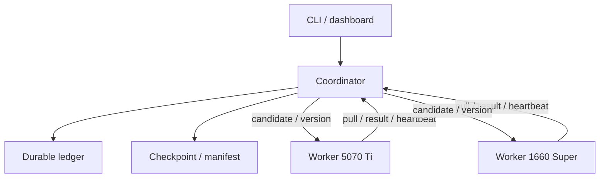
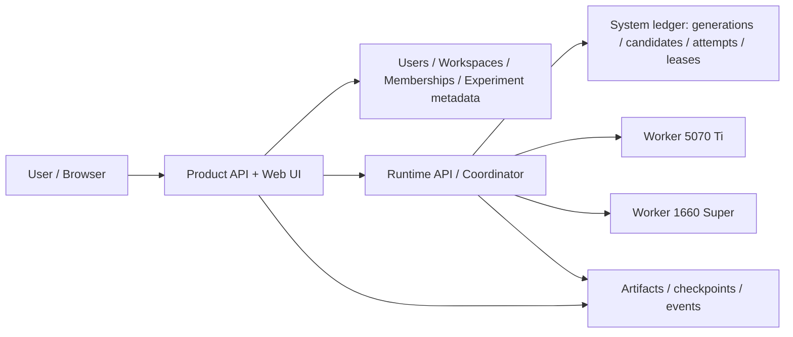
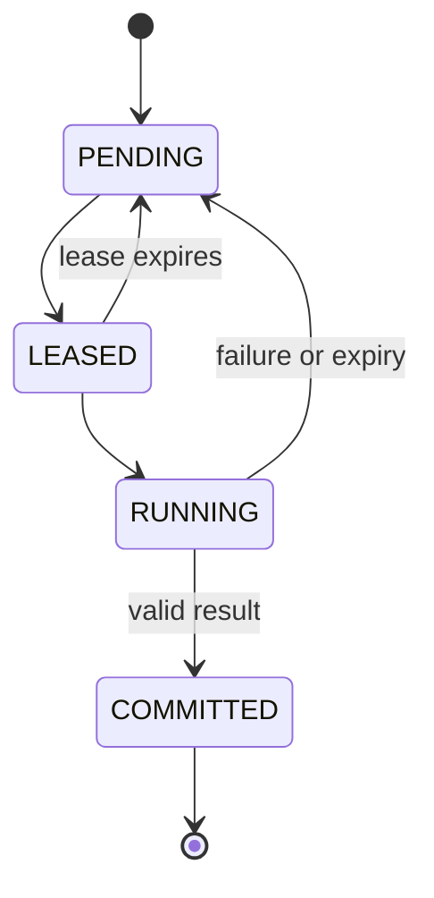

# HeteroES-LLM — Master

## Canonical technical specification, roadmap, learning appendix, and engineering history

**Last consolidated:** 30/09/2026 (physical two-GPU compatibility + canonical NoiseEngine decision + focused ES prior-art/code audit + team/product architecture)
**Project type:** IT engineering/application project, two students  
**Deadline:** 20/11/2026  
**Core/runtime feature freeze:** 08/11/2026  
**Result freeze:** 15/11/2026  
**Canonical companion:** `HETEROES_LLM_STATUS.md`

This file replaces the former separate `Master Proposal v3`, `Implementation Roadmap v3`, `Learning Guide v3`, and the stable technical content of the 20/09 chat handoff. It is the **single source of truth for what the project is, how it is designed, what must be implemented/evaluated, and what the team must understand**.

`HETEROES_LLM_STATUS.md` is the source of truth for **current completion state, detailed measurements, artifacts, and immediate next work**. This MASTER may retain a concise experimental rationale when it permanently changes a design contract (for example the canonical NoiseEngine decision), but planned sprint/gate text here must never be interpreted as completed merely because its calendar date has passed.

### Source precedence used during consolidation

1. Stable project/design decisions: v3 Master Proposal.
2. Detailed schedule, gates, artifacts, and experiment protocol: v3 Implementation Roadmap.
3. Teaching derivations, exercises, self-tests, and critique cases: v3 Learning Guide.
4. Historical implementation details: 20/09 Chat Handoff.
5. Current completion state/detailed results: **see `HETEROES_LLM_STATUS.md`**. MASTER only keeps short evidence summaries when they justify a stable design decision.

### One-minute mental model

HeteroES-LLM is a synchronous ES post-training system for a small heterogeneous consumer-GPU cluster. The project does **not** claim a new ES algorithm or a new generic dynamic queue. Its engineering focus is:

```text
C1 = Who may/should work?          capability + benefit-aware admission
C2 = Who gets which work?         controlled population execution policies
C3 = Which result is valid?       candidate/attempt/lease correctness under failure
C4 = Which model state is canonical? synchronization + replay consistency
```

The central product thesis is: a small lab should be able to **share a small pool of mismatched consumer GPUs among multiple members**, submit and observe reward-based ES experiments over **ordinary IP connectivity**, while the runtime preserves a precise numerical/protocol contract, knows when a slow worker is useful, recovers candidate work safely, and measures synchronization cost rather than assuming it is free. Dedicated multi-NIC, 2.5/10GbE, InfiniBand, or a special cluster fabric are optional optimizations, not deployment requirements.


## 0. Canonical design decisions

| Hạng mục | Canonical decision |
|---|---|
| Cách phát triển | Repo HeteroES riêng; nhóm thiết kế/implement tầng thực thi và ES reference nhỏ; không fork toàn bộ framework làm mặc định |
| Tái sử dụng | Dùng PyTorch/Transformers và thư viện phù hợp; tham khảo công thức/pattern; mọi mã sao chép/chỉnh sửa phải có provenance và tuân thủ license |
| ES-at-Scale | Reference và baseline có pin commit; không phải một đối thủ chỉ có static scheduling |
| Phát hiện audit | Main dùng static-wave; archive đã có completion-driven dispatch bằng `ray.wait` |
| Đóng góp trung tâm | C1 admission/sizing; C3 correctness/recovery; C4 synchronization; C2 là execution mechanism được kế thừa và đánh giá |
| Baseline | B0 fastest alone; B1 static-wave; B2 static proportional; B3 greedy dynamic; H0 full system |
| Hardware chắc chắn | RTX 5070 Ti 16 GB + GTX 1660 Super 6 GB, hai máy Linux; mỗi worker chỉ cần network connectivity bình thường |
| Model/task ban đầu | Qwen2.5-0.5B-Instruct + Countdown; pilot mới quyết định cấu hình cuối |
| ES recipe | One-point Gaussian, reward standardization; candidate là đơn vị lập lịch; two-point chỉ là future/ablation |
| Compatibility | Ưu tiên cùng backend/dtype/noise contract trên cả hai GPU |
| Lịch | Rebaseline từ 20/09; không coi các mốc cũ đã hoàn thành nếu chưa có artifact |
| Product model | Lab/workspace nhiều thành viên dùng chung một GPU pool; login, experiment ownership, queue/observability/artifacts phục vụ usability. Không biến đề tài thành public multi-tenant SaaS. |
| Quyền sở hữu | **A = Systems/Core owner**; **B = Product/Application owner**. Mỗi người sở hữu subsystem end-to-end, có tests/artifacts/demo riêng; không dùng số dòng code làm thước đo chính. |
| Physical baseline | Cả RTX 5070 Ti và GTX 1660 Super chạy được modified single-GPU ES reference với Qwen2.5-0.5B-Instruct ở FP16; physical compatibility không còn là blocker. |
| Canonical noise | Không dùng `torch.randn_like(..., device="cuda") + seed` làm cross-worker candidate identity. Hai GPU cho noise khác nhau ngay cả khi Torch/CUDA/Transformers được đồng nhất. |
| NoiseEngine v1 | Provisional canonical recipe: CPU NumPy PCG64; SHA-256-derived per-parameter-chunk seed; standard normal FP32; cast FP16; fixed chunk size thuộc contract. Full-model cross-machine probe đã cho identical noise bytes trên hai máy thử nghiệm. |

**Thesis của sản phẩm:** nhóm xây một hệ thống thực thi synchronous ES trên cụm GPU nhỏ, biết chọn worker có ích, phân việc đúng, phục hồi candidate khi worker lỗi và đồng bộ model với chi phí được đo trên hạ tầng mạng phổ thông sẵn có.

## 1. Bài toán thực tế và người dùng mục tiêu

Nhóm sinh viên/lab nhỏ thường sở hữu GPU mua ở những thời điểm khác nhau. Khác VRAM, tốc độ, kiến trúc GPU và network làm một training configuration chung khó vận hành hiệu quả. Dự án xét trường hợp mỗi worker có thể tự inference một bản sao model; không chia một model lớn qua nhiều GPU.

ES đánh giá các perturbed models độc lập trong một generation rồi tổng hợp reward để cập nhật. Đặc tính này phù hợp để tận dụng các GPU rời rạc qua **commodity networks**: cùng router/switch, Wi-Fi/private LAN, direct Ethernet, hoặc private overlay như Tailscale. Đây là động cơ kỹ thuật, không phải bằng chứng sẵn có rằng ES luôn nhanh hoặc ít VRAM hơn LoRA-GRPO.

**Người dùng mục tiêu:** sinh viên, nhóm nghiên cứu nhỏ và lab kinh phí hạn chế có **nhiều thành viên nhưng chỉ có một pool GPU nhỏ/không đồng nhất**. Hệ thống hướng tới việc giảm nhu cầu mỗi người tự SSH, tự giữ config và tự tranh tài nguyên bằng tay.

**Luồng sử dụng mục tiêu:** login → tạo/join lab workspace → xem GPU pool → add/profile worker → tạo experiment → submit/queue → theo dõi generation/failure → xem kết quả/artifacts → export checkpoint/metrics → evaluate/reproduce.

**Không giải quyết:** unified VRAM, general sharding, cross-vendor, untrusted Internet volunteer compute, **public multi-tenant SaaS**, billing/payment, enterprise SSO phức tạp, universal fine-tuning UI hoặc heterogeneous distributed GRPO. Multi-user trong phạm vi một lab/workspace tin cậy là product scope; public/untrusted WAN execution vẫn là future.

## 2. Tự phát triển, fork và giá trị đồ án

Fork một repository không tự làm đồ án yếu; tự viết lại mọi thứ không tự làm đồ án mạnh. Độ sâu phụ thuộc bài toán giải quyết, quyền sở hữu thiết kế, thay đổi hành vi, khả năng kiểm chứng và mức hiểu của người thực hiện. Đây là tiêu chí nội bộ, không phải rubric chính thức của trường.

Canonical design chọn **repo riêng + implementation tầng thực thi do nhóm sở hữu** vì ranh giới C1–C4 cần được kiểm soát và phần cứng mục tiêu có thể không phù hợp nguyên trạng với upstream. Quyết định này không nhằm che giấu sự kế thừa.

| Loại công việc | Cách ghi nhận |
|---|---|
| Thiết kế protocol, state machine, admission, sync policy | Nhóm thiết kế; ghi ADR và lý do |
| Implementation mới từ đặc tả toán học/thiết kế | Ghi tác giả, review, tests; vẫn trích dẫn thuật toán/pattern |
| Dùng thư viện bên thứ ba | Ghi dependency/version/license |
| Sao chép hoặc chỉnh sửa code upstream | Ghi nguồn, commit, file, thay đổi và license; không gọi là tự viết |
| Tái hiện policy benchmark | Ghi rõ policy reproduction, không gọi là chạy nguyên bản upstream |
| AI hỗ trợ code | Thành viên chịu trách nhiệm hiểu, kiểm chứng và khai báo theo yêu cầu học phần |

Một baseline ES nhỏ tự implement là bài tập correctness và nền kiểm chứng; không được quảng cáo là thuật toán mới. Không tự implement tokenizer, transformer kernels, HTTP stack hoặc database để tăng số dòng code.

**Bằng chứng cá nhân:** mỗi thành viên có module phụ trách, ADR, PR/review, tests hoặc experiment artifacts, và buổi demo đổi vai. Nhóm vẫn giữ hai người theo scope hiện tại; “đóng góp cá nhân” là phần truy vết trong đồ án nhóm.

## 3. Prior-art audit và ranh giới claim

Snapshot nền: `VsonicV/es-at-scale`, commit `574a9d134da1ffce2a8bb812019899e5c96b588a`, audit ban đầu ngày 20/09/2026. Ngày 30/09/2026 bổ sung một **focused source-code audit** đối với public `main` của ES-at-Scale, `yunpengba7/understanding-es` và `zz1358m/Agentic-ESOpt`. Đây vẫn là kiểm tra mã nguồn/tài liệu công khai; chưa phải benchmark các repo đó trên hai máy của nhóm và không chứng minh đã bao phủ mọi fork/PR/hệ thống không công khai.

### 3.1 ES-at-Scale: direct execution prior art và các implication

| Quan sát từ mã nguồn | Hệ quả cho đề tài |
|---|---|
| Full-parameter ES, scalar reward, multi-engine Ray/vLLM | Các tính năng nền không mới |
| Current trainer chủ động `ray.init(address="local")` và `evaluate_population_on_batch()` chạy **static-wave**: tối đa một seed/engine rồi chờ cả wave | Multi-node/heterogeneous runtime cần implementation + verification riêng; không suy ra Ray bản thân không hỗ trợ multi-node |
| Archive dùng `ray.wait(..., num_returns=1)` rồi cấp seed kế tiếp cho engine vừa rảnh | Completion-driven/greedy dynamic dispatch đã có prior art; **B3 là baseline bắt buộc, không phải novelty** |
| Current noise path tạo `torch.Generator(device=p.device)` và `manual_seed(seed)` lại cho từng parameter tensor | Không dùng upstream RNG path làm canonical noise; reset cùng seed per tensor có thể tạo stream trùng/prefix-correlated, ngoài vấn đề cross-GPU CUDA RNG |
| Current restore tái tạo cùng noise rồi cộng `-sigma * noise` | Arithmetic inverse không phải exact canonical-restore oracle của HeteroES |
| Update path accumulate FP32 rồi cast/apply | Pattern tốt để học; HeteroES reference cũng phải ưu tiên FP32 accumulation |
| Reward timeout bị biến thành `0.0`; eval path còn dùng `r/fmt` sau timeout | Infrastructure failure không được đồng nhất với task reward 0; C3 phải dùng typed error/retry semantics |
| Update tại engine 0 rồi full-weight broadcast | Có direct baseline cho full sync; broadcast không phải tính năng nhóm phát minh |
| Save/load weights | Chưa đồng nghĩa durable recovery của generation đang dở |
| Chưa thấy contract C1/C3/C4 đầy đủ trong mã đã audit | Là phạm vi phát triển/đánh giá của HeteroES, không phải chứng minh novelty toàn cầu |

Worker pull và coordinator dispatch khi worker rảnh có cùng mục đích cơ bản. Sự khác biệt API không đủ để tuyên bố scheduler mới. Nếu archive script khó chạy trên stack hiện tại, tái hiện policy tương đương trong benchmark harness và ghi rõ provenance.

### 3.2 Understanding-ES và Agentic-ESOpt: numerical/replay prior art gần nhất

Hai repo này làm rõ rằng **stable seed replay, local update reconstruction và replay history không phải ý tưởng mới**. Giá trị cho HeteroES nằm ở việc kiểm tra/siết contract khi worker khác kiến trúc GPU và khi distributed execution có retry/failure.

| Repo | Code pattern đáng học | Ranh giới so với HeteroES |
|---|---|---|
| `understanding-es` | Stable tensor namespace bằng BLAKE2b(name), deduplicate shared parameter object, sinh noise FP32, accumulate update FP32; mỗi replica reconstruct update locally và periodic parameter sync | Noise vẫn dùng `torch.Generator(device=parameter.device)` + CUDA `torch.randn`; trainer hard-reject multi-host (`All ES engines must be homogeneous and located on one host`), rendezvous `127.0.0.1`; population chia static shard bằng `ceil(len(seeds)/num_engines)` |
| `Agentic-ESOpt` | Stable tensor ID, FP32 Gaussian, chunked parameter processing, FP32 update accumulation; atomic `history.json` và replay completed updates khi resume | Noise vẫn là device/CUDA RNG; chunking dùng một sequential generator stream per parameter chứ chunk không có logical seed độc lập; optimization-history replay **không tương đương** candidate/attempt/lease ledger hay exactly-once committed effect |

**Stable lesson cho HeteroES:** học namespace, FP32 accumulation, chunked memory discipline, artifact/replay design; không copy CUDA RNG làm cross-worker identity và không dùng arithmetic `+noise/-noise` như proof exact restore. Canonical NoiseEngine của HeteroES cần versioned schema + parameter/chunk identity độc lập execution order, vì physical probes của nhóm đã chứng minh native CUDA seed replay không portable giữa 5070 Ti và 1660 Super.

### 3.3 Phân biệt đối chiếu trực tiếp và công trình lân cận

**ES-at-Scale là đối chiếu trực tiếp về ES-based LLM execution. Understanding-ES và Agentic-ESOpt là đối chiếu trực tiếp về numerical/replay recipe nhưng không giải quyết cùng heterogeneous-runtime target. Zorse và HexiScale KHÔNG làm ES; HetRL làm RL, không phải ES.** Không dùng việc các hệ thống này cùng có chữ “heterogeneous” để suy ra chúng đã triển khai C1–C4 cho ES hoặc làm giảm phần đóng góp ES-specific của nhóm.

Về cấu trúc workload, Zorse/HexiScale tối ưu gradient-based training với các kiểu phân chia và communication phục vụ training. HeteroES thực thi các model perturbations trên replicas độc lập, rồi aggregate reward/update theo generation. Đây là khác biệt cơ chế, không chỉ khác tên sản phẩm. Chúng chỉ là bối cảnh cho claim heterogeneous training tổng quát; không phải experimental baseline bắt buộc của đồ án.

| Công trình | Phần giao với đề tài | Ranh giới |
|---|---|---|
| ES-at-Scale | Full-parameter ES + Ray/vLLM multi-engine; current static-wave; archive completion-driven dispatch; engine-0 update + broadcast | B1/B3/full-sync là prior art/baseline; không có nghĩa C1/C3/C4 heterogeneous contract đã được giải quyết |
| Understanding ES for LLM Reasoning | One-point ES, stable per-tensor seed namespace, FP32 reconstruction/update, local replay + periodic sync, evaluation methodology | Canonical artifact yêu cầu homogeneous one-host engines; CUDA/device RNG; static seed sharding |
| Agentic ESOpt | Full-parameter forward-only ES cho agent dài hạn; stable tensor ID, chunked FP32 replay/update, atomic optimization history | Không nhận black-box/seed replay là novelty; history replay không thay C3 distributed ledger; CUDA/device RNG không đủ cho HeteroES candidate identity |
| QES | Quantized ES, stateless seed replay | Quantization/replay không phải ý tưởng mới; giữ future |
| EGGROLL/LOO-ROLL | Low-rank perturbations | Không mở thêm backend vào critical path |
| Forgather | Consumer GPU, multi-node LAN, discovery/UI | Consumer/LAN/UI riêng lẻ không đủ khác biệt |
| HetRL | RL post-training trên GPU/network không đồng nhất | Heterogeneous LLM post-training đã có prior art |
| Zorse/HexiScale | Gradient-based heterogeneous training; không thực thi ES | Bối cảnh hệ thống; không chứng minh ES-specific orchestration đã bị làm |
| TRL/GRPO | Custom verifier reward, post-training ecosystem | Arbitrary reward không độc quyền của ES |

Không dùng: first distributed ES, first heterogeneous training, first dynamic queue, first seed replay, first local update reconstruction, ES luôn nhanh/ít VRAM hơn RL, GPU VRAM được cộng lại.

Có thể dùng: **hệ thống được nhóm thiết kế, triển khai và đánh giá cho synchronous ES trên cụm consumer GPU nhỏ/không đồng nhất, với portable candidate identity, admission, failure correctness và synchronization trade-off được kiểm chứng trên topology công bố rõ.** Câu này vẫn là mô tả phạm vi/đóng góp engineering, không phải claim “đầu tiên trên thế giới”.

### 3.4 License và provenance

ES-at-Scale dùng Academic Public License, không phải MIT/Apache. Tài liệu license cho phép các mục đích phi thương mại gồm giáo dục/nghiên cứu và đặt điều kiện sửa/phân phối; dùng thương mại cần license riêng. Repo riêng hoặc adapter không tự xóa nghĩa vụ của phần code dựa trên upstream. `understanding-es` và `Agentic-ESOpt` hiện công bố MIT license; vẫn phải ghi provenance khi copy/modify code.

Tạo `THIRD_PARTY.md` trước khi đưa code bên ngoài vào: origin URL, commit, file/component, loại reuse, license, sửa đổi và người kiểm tra. Không tuyên bố clean-room hay license độc lập chỉ vì đã đổi cấu trúc thư mục. Thuật toán và kết quả prior art luôn được trích dẫn dù không copy code.

## 4. Mục tiêu và bốn phần đóng góp

| ID | Nội dung nhóm phải làm | Bằng chứng tối thiểu |
|---|---|---|
| **C1** | Capability, safe chunk và benefit-aware admission | Hai profile thật, reason code, prediction trước run, forced-admit comparison |
| **C2** | Thực thi population có các policy đối chứng | B0/B1/B2/B3/H0, cùng workload, thời gian và idle/tail |
| **C3** | Candidate/attempt correctness dưới worker failure | Lease, dedup, stale/version rejection, atomic commit, fault traces |
| **C4** | Canonical sync và replay consistency | Full sync chạy được; ít nhất full vs một replay-based experiment; bytes/time/drift |

C1–C4 là engineering contributions, không phải bốn thuật toán mới. C2 là phần tích hợp và đánh giá trên cơ chế đã biết. C3 và C4 giữ giá trị khi dynamic execution không nhanh hơn baseline trong một regime.

## 5. Canonical scope

| Tầng | Nội dung |
|---|---|
| **SYSTEM CORE** | ES reference đúng; một model/task; hai worker vật lý nếu qua compatibility; C1–C4; B0/B1/B2/B3/H0; ledger/lease/recovery; CLI/telemetry tối thiểu để chạy và đo |
| **PRODUCT CORE** | Login local/self-hosted; lab workspace; Admin/Researcher/Viewer; shared worker-pool visibility; experiment ownership; **non-preemptive experiment queue**; cluster/experiment/live-run views; result/artifact browser |
| **SUPPORTING** | Invite code/member onboarding; usage accounting; run comparison; clean setup/usability trial; GRPO time-boxed; coordinator restart; energy estimate nếu rẻ |
| **STRETCH** | Quota enforcement; richer notifications; tail-aware finish; third GPU; mDNS; homogeneous scaling; speculative execution; UI polish |
| **FUTURE** | Public SaaS/multi-tenant isolation, billing/payment, enterprise SSO, QES, EGGROLL/LOO-ROLL, adaptive sigma, async/stale ES, distributed GRPO, WAN/cloud, cross-vendor, general sharding, untrusted coding sandbox |

**Hardware/network:** Linux/NVIDIA; mỗi worker một GPU và chỉ cần **một đường IP connectivity khả dụng** tới coordinator/cluster. Chắc chắn theo roadmap: 5070 Ti 16 GB và 1660 Super 6 GB. Reference experiments có thể chạy trên cùng LAN, nhưng dedicated switch, NIC thứ hai, 2.5/10GbE hay shared filesystem không phải requirement. Private overlay như Tailscale được phép cho remote management/execution; actual path và throughput phải được profile. GPU mượn không nằm trên critical path.

**Model/task:** Qwen2.5-0.5B-Instruct/Countdown để pilot. 1.5B là nâng cấp sau evidence; 3B là future trong cửa sổ hiện tại. Arithmetic exact-answer là fallback; GSM8K-like là task bổ sung khi pipeline đã ổn. Khóa revision, split, template, verifier và decode config.

**Backend:** mặc định thiết kế worker PyTorch/Transformers với cấu hình chung được pilot. vLLM hoặc Ray là lựa chọn qua ADR khi chứng minh giảm công sức/chi phí; không duy trì hai production backends đồng thời. Không suy ra 1660 Super không chạy được vLLM chỉ từ BF16 default của upstream.

## 6. ES recipe và numerical contract

Với objective reward \(J(\theta)\), Gaussian smoothing:

\[
J_\sigma(\theta)=\mathbb E_{\epsilon\sim\mathcal N(0,I)}[J(\theta+\sigma\epsilon)].
\]

Mỗi generation tạo N candidates với seeds độc lập; mỗi candidate evaluate một perturbation:

\[
\epsilon_i\overset{iid}{\sim}\mathcal N(0,I),\qquad R_i=R(\theta_t+\sigma\epsilon_i).
\]

Raw estimator có \(1/(N\sigma)\); recipe standardized dùng:

\[
\mu=\frac1N\sum_i R_i,\quad s=\sqrt{\frac1N\sum_i(R_i-\mu)^2},\quad
z_i=\frac{R_i-\mu}{s+\eta},\quad
\theta_{t+1}=\theta_t+\frac\alpha N\sum_i z_i\epsilon_i.
\]

\(\eta>0\) là numerical guard được ghi trong config. Reward đồng nhất → coefficients bằng 0 → no-op update có log. NaN/Inf reward là lỗi, không im lặng đổi thành 0. Standardized direction là practical recipe; không gọi nó là raw unbiased gradient estimator. Sigma cố định trong core; hai-point/antithetic không có trong protocol mặc định.

### Noise contract

Candidate identity phải độc lập với GPU vật lý thực thi. Kết quả probe vật lý ngày 29/09/2026 đã loại `torch.randn_like(..., device="cuda") + seed` khỏi vai trò **canonical cross-worker RNG**: RTX 5070 Ti và GTX 1660 Super sinh noise bytes khác nhau, kể cả sau khi đồng nhất PyTorch `2.13.0+cu132`, CUDA runtime `13.2`, Transformers `5.17.0`, model revision, FP16 dtype, parameter schema và workload. Vì vậy **same seed không đồng nghĩa same candidate** nếu recipe còn phụ thuộc CUDA RNG.

Canonical/provisional `NoiseEngine v1` được khóa theo các thành phần sau:

- model revision + canonical parameter schema hash; schema gồm name, shape, order, dtype và alias/tied-weight mapping;
- `noise_engine_version`; candidate seed; parameter index; chunk index; fixed `chunk_elements`;
- seed từng chunk được derive deterministically bằng SHA-256 từ logical identity ở trên;
- PRNG canonical: CPU NumPy `PCG64`; distribution standard normal; generation dtype FP32; cast/application dtype FP16 cho baseline vật lý hiện tại;
- chunk identity độc lập với execution order, để worker perturb và coordinator reconstruct cùng bytes mà không phụ thuộc CUDA architecture;
- NumPy version vẫn được ghi/pin trong production contract dù full probe hiện tại cho identical bytes giữa NumPy 2.5.2 và 2.5.3; compatibility quan sát được không phải lời hứa cho mọi version tương lai;
- aggregation theo thứ tự candidate canonical, không theo thứ tự result đến;
- mọi path `perturb candidate`, `reconstruct noise`, `ES update`, replay/debug phải dùng **cùng một NoiseEngine implementation**, không copy RNG logic sang nhiều nơi.

Bằng chứng hiện tại cho NoiseEngine v1 là **full-model cross-machine probe** trên Qwen2.5-0.5B-Instruct: 290 parameter tensors, 494,032,768 elements, cùng model revision/schema/seed/chunk/mode và `same_noise_bytes = PASS` giữa RTX 5070 Ti và GTX 1660 Super. Claim này chỉ áp dụng cho recipe/environment đã đo; không gọi là universal cross-platform reproducibility.

### Apply/restore/update

Reference restore phải trở về canonical state bằng bản sao/snapshot có kiểm chứng; cộng noise âm đơn thuần không được coi là bằng chứng khôi phục chính xác. Snapshot có thể ở CPU hoặc GPU tùy memory và chi phí đã đo. Update accumulation ưu tiên FP32; actual applied update vẫn phải kiểm tra sau cast.

Ghi requested/constructed/applied norms, changed-coordinate fraction và tied parameter behavior trong diagnostic mode. Không đòi mọi diagnostic sâu chạy ở production; không được tắt invariant bắt buộc chỉ để benchmark nhanh hơn.

### 6.1 Physical numerical evidence — 29/09/2026

Hai máy vật lý đã chạy full modified single-GPU ES reference ở FP16. Cross-worker compatibility probe cho thấy model revision, dtype, schema, parameter count, canonical weight samples, workload, base reward/base predictions và exact restore đều match. Tuy nhiên CUDA-native seed replay cho `same_noise_stream_sample = DIFF`, `same_noise_target_hashes = DIFF`, và candidate predictions khác. Kết quả này lặp lại sau khi 5070 Ti được đưa sang environment cùng PyTorch/CUDA/Transformers với 1660 Super.

Controlled follow-up bằng Canonical NoiseEngine v1 chạy full model cho `same_noise_bytes = PASS`; khác biệt còn lại trong probe là NumPy `2.5.3` trên 5070 Ti và `2.5.2` trên 1660 Super. Đây là evidence dẫn tới design decision ở Noise contract phía trên. Runtime/probe artifacts và exact outputs thuộc STATUS, không dùng phần này để suy ra distributed generation đã hoàn thành.

## 7. Kiến trúc và quyền sở hữu trạng thái



Coordinator sở hữu experiment/generation/candidate state, admission, scheduling, lease/result validation và quyền công bố model version mới. Một canonical update executor được chỉ định tạo checkpoint; có thể đặt trên worker mạnh, không cần coordinator chạy inference. Worker giữ model replica theo version và thực thi candidate; không tự chạy optimizer riêng.

### 7.1 Commodity-network deployment contract

**Minimum network requirement:** coordinator và worker có thể trao đổi IP traffic ổn định. HeteroES không yêu cầu mỗi máy có nhiều NIC, dedicated cluster switch, 2.5/10GbE, InfiniBand hay shared filesystem. Một desktop chỉ có một Ethernet port vẫn là deployment bình thường.

Ba deployment mode được hỗ trợ ở mức architecture:

| Mode | Topology | Vai trò |
|---|---|---|
| `LAN` | cùng router/switch/Wi-Fi private network | default/reference khi các máy ở cùng địa điểm |
| `TAILSCALE` | private overlay giữa các máy ở khác network | remote/easy-deploy mode; phải log direct-vs-relay nếu đo performance |
| `DIRECT_LINK` | Ethernet trực tiếp giữa hai máy | optional benchmark/advanced setup; không phải requirement |

Underlying transport không được thay đổi logical protocol. Coordinator address là configuration; worker contract, candidate identity, leases và result semantics giữ nguyên dù chạy trên LAN hay Tailscale.

### 7.2 Control plane và data plane

Tách hai loại traffic để tránh biến network bandwidth thành một dependency giả:

- **Control plane:** heartbeat, registration, candidate descriptor, lease, result metadata/reward, status. Payload nhỏ; mục tiêu là reliability/latency, không cần link tốc độ cao.
- **Data plane:** initial checkpoint/model distribution, full model synchronization, recovery transfer. Payload lớn; C4 phải đo actual bytes/time và so với local replay compute.

Do đó network chậm không làm protocol sai; nó chỉ có thể làm một sync policy kém hiệu quả. Hệ thống phải đo chứ không giả định network là miễn phí hay luôn nhanh.

Stack mặc định: Python; FastAPI/HTTP; SQLite/WAL trên một coordinator; local artifact store; PyTorch/Transformers worker. WAL không biến database và checkpoint filesystem thành một transaction duy nhất. Không thêm Redis/Postgres/Kubernetes nếu chưa có nhu cầu cụ thể. Tailscale là optional private networking layer, không thay thế application-level ledger/protocol.

Interface nhỏ: backend load/validate state, evaluate candidate, restore state, apply accepted recipe, export state. Coordinator chỉ nhận descriptor/result; không phụ thuộc vLLM internals. Nếu dùng Ray qua ADR, vẫn giữ application ledger và model-version contract của nhóm.

### 7.3 Product/application architecture for a small lab

Product layer nằm **trên** systems runtime; UI/database product không được trở thành nơi duy nhất giữ correctness của candidate/lease/commit. Mục tiêu là biến runtime thành một công cụ self-hosted mà nhiều thành viên của một lab nhỏ có thể dùng chung.



**Product-domain state (B owns):**

```text
User
Workspace/Lab
Membership + role
Experiment metadata + owner
Experiment queue entry
Artifact index / result presentation
Usage summary
Product/audit event presentation
```

**System-domain state (A owns):**

```text
Worker/runtime capability
Model version
Generation
Candidate
Attempt
Lease
Commit/rejection
Admission profile
Scheduler state
Sync/replay state
```

Ba role product đủ cho core demo:

| Role | Quyền tối thiểu |
|---|---|
| `ADMIN` | quản lý workspace members, worker visibility/settings product-level, mọi experiments |
| `RESEARCHER` | tạo/run/cancel experiment của workspace theo policy, xem cluster/results/artifacts |
| `VIEWER` | chỉ xem dashboard, experiment và artifacts được phép |

**Experiment queue != candidate scheduler.** Product queue giải quyết nhiều user tranh một GPU pool: experiment có trạng thái `QUEUED/RUNNING/FINISHED/FAILED/CANCELLED` và mặc định **không preempt** run đang chạy. Khi một experiment đã `RUNNING`, candidate allocation B1/B2/B3/H0 hoàn toàn thuộc systems runtime/C2; product layer không tự gán candidate cho GPU.

**Integration contract:** Product layer submit một immutable experiment configuration đã được validate/authorized; systems layer trả `run_id` và phát observable events/state. Product layer có thể cache/project trạng thái để hiển thị nhưng không được tự sửa lease, commit, model version hoặc fabricate runtime result.

**Application security scope:** login/password/session hoặc tương đương self-hosted auth là đủ; không cần billing, public account recovery service, social-login matrix hay enterprise SSO để core-complete. Credentials không được ghi vào run artifacts.

## 8. C1: Capability và lợi ích tham gia

Admission gồm hai bước: **hard capability gate** và **benefit policy**. Một worker không chạy đúng workload không được override bằng force-admit.

Trạng thái tối thiểu: `INELIGIBLE`, `ELIGIBLE_BUT_NOT_BENEFICIAL`, `ADMITTED_LIMITED`, `ADMITTED`; reason code chi tiết cho memory/backend/dtype/version/performance.

Profile gắn với GPU, driver/runtime, model/schema hash, backend/dtype, context/decode config, prompt workload, safe chunk, **network path/RTT/throughput thô** và thời điểm đo. Với Tailscale, nếu dùng cho performance experiment thì log direct hay relay. Chỉ reuse profile khi key phù hợp. Safe chunk là mức đã kiểm tra, không bảo đảm không OOM với mọi prompt tương lai.

Benefit model tối giản dùng candidate duration, chunk/throughput, tail và chi phí sync/update:

\[
\operatorname{Admit}(w)\iff \widehat T(W\cup\{w\})<\widehat T(W)-\delta.
\]

Lưu prediction trước benchmark; forced-admit trên cùng workload để kiểm tra hướng tác động. Phân biệt:

\[
\mathrm{ClusterBenefit}(W)=\frac{T_{fastest\ alone}}{T(W)},\qquad
\Delta T_w=T(W)-T(W\cup\{w\}).
\]

Thêm một worker sẵn có không bắt buộc scheduler giao việc cho nó. Chậm đi có thể do policy giao candidate cuối, nghĩa vụ replay/sync, contention hoặc overhead. Admission cần giải thích cơ chế, không tự tạo gánh nặng rồi coi việc bỏ gánh nặng đó là breakthrough.

Worker yếu làm cùng prompt set và decode budget; chỉ chia chunks nhỏ hơn. Không cho worker yếu ít prompt hơn rồi average ngang nhau.

## 9. C2: Policy và thí nghiệm kiểm soát

| ID | Hành vi |
|---|---|
| `B0_FASTEST` | Worker nhanh nhất chạy một mình |
| `B1_STATIC_WAVE` | Mỗi wave tối đa một candidate/worker; chờ wave xong |
| `B2_STATIC_PROPORTIONAL` | Chia trước số candidate theo profile, mỗi worker chạy quota liên tục |
| `B3_GREEDY_DYNAMIC` | Worker rảnh nhận candidate kế tiếp; tương đương nguyên lý archive |
| `H0_FULL_SYSTEM` | Dynamic execution + admission + sizing + production sync/recovery contract của HeteroES |

B2 và B3 đều là baseline CORE. Static equal theo quota là comparator tùy chọn, không đồng nhất với static-wave. Tail-aware chỉ thêm sau khi đo được tail bottleneck và core đã ổn.

**Tách các yếu tố:** scheduler comparison B1/B2/B3 giữ cùng eligible workers, per-worker chunks, sync mode, candidate set và numerical contract. Admission comparison dùng cùng dynamic policy, thay forced membership/policy admission. Sizing comparison dùng common-fit chunk vs per-worker chunk khi cả hai cấu hình đều hợp lệ. Sync comparison giữ policy/chunk/membership. H0 là đánh giá tích hợp; không quy mọi speedup của H0 cho scheduler.

Không cần full factorial mọi biến. Chọn một ablation cho mỗi claim định đưa vào kết luận. Nếu H0 cấu hình trùng B3 hoàn toàn, dùng chung kết quả và nói rõ hai condition đồng nhất, không tạo một so sánh giả.

## 10. C3: Protocol và failure model

Candidate descriptor tối thiểu:

```yaml
experiment_id:
generation_id:
candidate_id:
attempt_id:
model_version:
seed:
noise_recipe_hash:
batch_ids:
generation_config_hash:
lease_token:
lease_deadline:
```

Result gồm worker ID, candidate/attempt/version/lease identity, reward summary, prompt count, tokens, timings, restore status và typed error nếu có.

**Bất biến bắt buộc:**

1. Mỗi candidate có tối đa một committed effect trong generation.
2. Retry tạo attempt/lease mới, giữ candidate/seed/workload/version/noise recipe.
3. Result chỉ được commit nếu attempt/lease/version còn hợp lệ.
4. Duplicate delivery sau ACK loss không tạo reward thứ hai.
5. Generation chỉ aggregate khi đủ expected valid candidate set; không lấy N kết quả nhanh đầu tiên.
6. Model version mới chỉ dùng sau khi checkpoint/recipe được công bố hợp lệ.
7. Worker restore thất bại bị quarantine; không nhận candidate tiếp.



State trên thuộc logical candidate; rejection thuộc result/attempt event. Result cũ bị reject không được làm candidate đang retry chuyển sang terminal failure.

Failures CORE: worker disconnect giữa candidate, late result, duplicate/ACK loss, wrong version, verifier infrastructure error, restore mismatch. Retry budget có giới hạn; exhausted budget → generation failed/paused rõ ràng, không tự đổi candidate hoặc cho reward 0. OOM downshift chỉ giữ semantics khi giảm chunk, restore sạch và chạy lại attempt theo policy.

Coordinator restart là SUPPORTING. Nếu triển khai, cần durable update intent, checkpoint staging/publish và reconciliation; tránh crash sau ghi weights nhưng trước commit metadata dẫn tới update hai lần. Nếu chưa làm, CLI phải nói rõ chỉ hỗ trợ worker recovery và resume từ committed checkpoint.

## 11. C4: Canonical sync, commodity networks và reproducibility

C4 không yêu cầu network tốc độ cao để **đúng**. Mục tiêu là giữ canonical model state và đo trade-off giữa network transfer, local reconstruction compute và numerical drift trên hạ tầng người dùng thực sự có.

Ba chế độ: `FULL_SYNC_EVERY_GENERATION`, `REPLAY_ONLY`, `REPLAY_WITH_PERIODIC_RESYNC`.

CORE phải có full sync production reference và ít nhất một replay-based measurement. Replay production/periodic resync chỉ được bật sau consistency gate; nếu không qua, giữ full sync và báo limitation. Không bắt buộc triển khai production cả ba chế độ để core-complete.

### 11.1 Network-aware measurement, không network-aware overengineering

Trước sync experiment, đo ít nhất:

- path type: LAN / Tailscale direct / Tailscale relay / direct-link;
- RTT cơ bản;
- throughput thô (ví dụ `iperf3` khi khả thi);
- actual checkpoint/model transfer bytes và wall-time;
- local replay reconstruction/update time trên từng worker.

Core v1 **không cần tự động chọn policy bằng thuật toán phức tạp**. Có thể chọn sync mode bằng config/ADR dựa trên measurements. Automatic network-aware sync selection chỉ thêm nếu có thời gian và evidence rằng nó giải quyết bottleneck thật.

Interpretation theo regime phải trung lập: link chậm có thể làm replay hấp dẫn hơn; link nhanh có thể làm full sync đủ rẻ; worker yếu có thể khiến replay compute đắt hơn network transfer. Không được kết luận một policy luôn tốt hơn từ một topology.

Mỗi generation lưu parent/current model version, seeds/coefficients, parameter schema/noise recipe/config hash, bytes/time, update compute, network path metadata và drift. Replay có thể phải tái tạo N perturbations trên từng worker; phải tính chi phí này vào end-to-end time, nhất là trên worker yếu.

Kiểm tra ba lớp: parameter difference/checksum; update norm; canary logits/output/reward. Sampled checksum không chứng minh toàn model giống nhau; checksum mismatch không nói độ lệch lớn bao nhiêu. Chính sách tolerance và sampling phải được khai báo trước experiment.

Ví dụ lý thuyết: 0.5 tỷ tham số × 2 bytes ≈ 1 GB; trên link 1 Gbit/s lý tưởng cần khoảng 8 giây cho một payload qua link. Đây chỉ là phép tính dung lượng/băng thông, chưa tính overhead, không phải benchmark của hệ thống. 100 Mbps, 1GbE hay 2.5GbE đều là regime hợp lệ nếu đó là hạ tầng thật; benchmark phải báo đúng topology thay vì coi một tốc độ cụ thể là requirement.

## 12. Evaluation questions và tiêu chí thành công

| EQ | Câu hỏi | Bằng chứng |
|---|---|---|
| EQ1 | ES update/reload đúng và có learning evidence? | Reference math, perturb/restore, held-out base/final |
| EQ2A | Admission dự đoán đúng lợi ích thêm worker? | Prediction vs forced-admit, ΔT và ClusterBenefit |
| EQ2 | Scheduling tích hợp hữu ích ở regime nào? | B0/B1/B2/B3/H0, idle/tail, controlled ablation |
| EQ4 | Worker failure có làm sai candidate/generation? | Fault traces, commit counts, no stale effects |
| EQ6 | Sync/replay đánh đổi network–compute–drift ra sao? | Full vs replay measurement, canary checks |
| EQ3 | Scaling khi thêm worker? | SUPPORTING/STRETCH nếu có hardware; không giả hardware thật |
| EQ5 | ES vs practical LoRA-GRPO? | SUPPORTING, single-GPU và time-boxed |

Một scheduler không thắng hoặc replay không đủ ổn định không tự làm fail đồ án nếu core chạy đúng, measurement hợp lệ và giới hạn được trình bày. Tuy nhiên, không có ES hoạt động, không có hai-worker execution thật hoặc không có recovery đúng thì chưa đạt mục tiêu sản phẩm đã nêu.

Không yêu cầu benchmark số đẹp. Mọi số liệu chưa chạy phải ghi `NOT_RUN`; không điền số từ paper vào cột số đo của nhóm.

## 13. Benchmark methodology và metrics

Scheduler benchmarks dùng frozen parent checkpoint/candidate list để hạn chế confound do model learning trajectory. Learning runs là thí nghiệm riêng. Giữ hoặc log rõ model/data/verifier/noise/backend/dtype/decode/chunk/sync configuration; ghi warm-up và cache policy.

Tối thiểu 3 repeats cho condition chính; 5 nếu ngân sách cho phép. Với mẫu ít, báo raw runs/median/min–max, tránh bootstrap interval tạo cảm giác chắc chắn quá mức. Randomize hoặc luân phiên thứ tự conditions để giảm thermal/cache bias.

| Nhóm | Metrics |
|---|---|
| AI | Base/final held-out accuracy/reward, format vs task reward, train curve, reward variance |
| Time | Load, perturb, rollout, reward, restore, update, sync, coordinator; end-to-end generation |
| Resource | Tokens, completions, reward calls, peak GPU VRAM, CPU RAM, GPU-hours |
| Heterogeneity | Jobs/worker, idle/tail, profile overhead, admission prediction/error |
| Network | Path type, RTT, throughput thô, direct/relay nếu Tailscale, initial distribution, bytes/generation, sync/recovery/log traffic |
| Reliability | Retry attempts, lost/duplicate committed candidates, stale rejection, recovery latency |
| Consistency | Parameter/update drift, canary output/reward mismatch, resync reason |

Nếu kernel/chunk/backend làm thay đổi outputs, log token/reward differences; không gọi đó là exact-equivalent workload outcome. Cùng prompts là cần thiết nhưng chưa đủ chứng minh numerics tương đương.

## 14. GRPO supporting baseline

Dùng một recipe TRL + LoRA ổn định trên 5070 Ti; QLoRA chỉ sau compatibility check. Không implement GRPO từ đầu, không distributed GRPO. Tối đa hai ngày tích hợp sau khi core đã có evidence.

Giữ same base checkpoint/split/reward/max length; eval cùng policy. Không ép training decoding giống nhau khi làm hỏng phương pháp; ghi rõ ES parameter-space exploration và GRPO action-space sampling khác nhau. Báo tokens, wall-clock, VRAM, GPU-hours và held-out performance, không chỉ số generations.

Nếu blocked, lưu config/error và ghi `BLOCKED`; không giả số liệu hoặc dùng paper results như kết quả chạy của nhóm. Không để GRPO chặn C1–C4.

## 15. Repository, artifacts và learning assets cũ

```text
src/heteroes/{core,coordinator,worker,rewards,telemetry}
configs/{smoke,experiments}
tests/{unit,contract,integration,fault}
baselines/es_at_scale_policy/
baselines/grpo/
docs/{adr,learning}
scripts/{smoke,benchmark}
THIRD_PARTY.md
```

Run artifacts: config, model/data/environment/hardware manifests, events, candidates, workers, generations, checkpoints, eval outputs. Large weights/data không commit vào Git; giữ hash, config và lệnh tái tạo. Code commit, dirty-tree flag và backend versions phải được log.

RadiusLab assets có thể giữ: numerical no-op checks, norms, tied parameters, seed namespaces, transactional restore, verifier, cost/VRAM instrumentation, fault fixtures, replay/corruption checks. Phải inventory actual code trước khi gọi là reusable; không suy ra chỉ từ tài liệu rằng chúng đã đúng hoặc còn chạy.

Adaptive sigma/SNR detector, root-finding/reset controller và kết luận pilot cũ được archive; không nằm trên critical path. Việc chuyển sang systems project không hồi sinh giả thuyết đã bị falsify.

## 16. Ownership, team boundary và cách dùng AI

### 16.1 Canonical ownership split

Nhóm cố ý chia theo **subsystem ownership**, không chia theo số dòng code. A đang sở hữu hai máy vật lý và chịu trách nhiệm chiều sâu distributed/system trước; B sở hữu product layer end-to-end để biến runtime thành công cụ dùng được bởi một lab nhiều thành viên.

| Track | **A — Systems/Core owner (hardware owner)** | **B — Product/Application owner** |
|---|---|---|
| Mission | Correct distributed ES runtime trên heterogeneous GPUs | Biến runtime thành self-hosted lab product dễ dùng và demo được |
| Core code | ES/Qwen reference; worker runtime; coordinator runtime; ledger; candidate/attempt/lease; C1/C2/C3/C4 | Auth; workspace/membership; experiment product API; non-preemptive job queue; dashboard; artifacts/results UX |
| Hardware | 5070Ti/1660S compatibility, Tailscale/LAN, GPU/network profiling, physical fault runs | Không cần sở hữu GPU; phát triển với mock/runtime API fixtures và tích hợp remote khi API ổn |
| Correctness | numerical/protocol invariants, commit semantics, sync/replay | authorization, experiment ownership, state presentation, không biểu diễn sai candidate/attempt semantics |
| Experiments | systems benchmark/fault/sync/admission evidence | usability flow, multi-user flow, product integration/demo evidence |
| Evidence cá nhân | ADR, system code/tests, raw physical artifacts, fault/numerical demo | product ADR/data model, product backend/UI code/tests, usability/demo trace |
| Review chéo | review product↔runtime boundary và security-sensitive actions | hiểu generation/candidate/attempt đủ để review UI semantics và demo core flow |

### 16.2 Boundary để hai người không đụng nhau

A cung cấp **runtime contract**; B không cần chờ real GPU để phát triển. B dùng mock fixtures trước, sau đó thay mock bằng runtime API thật.

Runtime capabilities mà B được phép dựa vào (tên endpoint cụ thể có thể đổi qua ADR, semantics không đổi):

```text
list workers + capability/admission/status
submit an authorized experiment/run config
read experiment/run state
read generation/candidate/attempt observable state
stream/read runtime events
cancel a run through a validated coordinator action
list artifacts/results produced by a run
```

A **không** nhét UI-specific state vào candidate/lease ledger. B **không** trực tiếp mutate system tables hoặc tự quyết định candidate commit/scheduling.

### 16.3 Product owner (B) — task list có thể bắt đầu ngay

B có thể làm các phase sau bằng fake JSON/API fixtures trước khi two-node runtime hoàn tất.

#### P0 — Product specification + mock contract

- Vẽ user flow: `login → workspace → cluster → new experiment → queue/run → live view → result/artifacts`.
- Chốt data model: `users`, `workspaces`, `memberships`, `experiment_metadata`, `queue_entries`, `artifact_index`, `product_audit_events`.
- Chốt 3 roles: Admin / Researcher / Viewer.
- Tạo mock payload cho worker, experiment, generation, candidate attempt, failure event.
- Tạo wireframe 5 màn hình: Cluster, Experiments, Live Run, Results/Artifacts, Members.

**Done khi:** có schema/wireframe + mock data đủ để frontend chạy mà không cần GPU.

#### P1 — Authentication + Lab Workspace

- Local/self-hosted login/logout/session.
- Create/join workspace ở mức tối thiểu; membership + role checks.
- Members page; Admin có thể thêm/xóa/đổi role bằng flow đơn giản (invite code có thể để P5).
- Route/API authorization: Viewer không start/cancel run; Researcher không quản lý members.

**Done khi:** 2 tài khoản khác nhau vào cùng workspace và quyền khác nhau được test.

#### P2 — Cluster UX + worker onboarding presentation

- Cluster overview: worker online/offline, GPU/VRAM, candidate runtime/profile, network path, admission state/reason.
- Worker details: capability, safe chunk, current job, recent failures.
- `Add Worker` UX tạo hướng dẫn/command join; **worker registration/health semantics thật vẫn do A implement**.
- Mock states phải cover `ADMITTED`, `ADMITTED_LIMITED`, `ELIGIBLE_BUT_NOT_BENEFICIAL`, `INELIGIBLE`.

**Done khi:** dashboard giải thích được vì sao một worker được/không được dùng mà không cần đọc raw logs.

#### P3 — Experiment management + multi-user queue

- `New Experiment` form: model/task/population/generations/scheduler/admission/sync; advanced parameters ẩn mặc định.
- My Experiments + Lab Experiments + status.
- Experiment ownership và cancel authorization.
- Non-preemptive queue giữa experiments; hiển thị position/owner/status.
- Không implement candidate scheduler trong product queue.

**Done khi:** hai researchers submit jobs, một job RUNNING và job sau QUEUED; ownership/permissions đúng bằng mock runtime.

#### P4 — Live run + failure visualization

- Generation progress và jobs/worker.
- Candidate detail phải phân biệt candidate với attempt.
- Failure timeline: lease expired → retry attempt mới → stale/duplicate result rejected → candidate committed.
- Network/sync panel: bytes, transfer time, replay compute nếu runtime có metric.

**Done khi:** có thể replay một deterministic event trace và UI biểu diễn đúng C2/C3/C4 semantics.

#### P5 — Results, artifacts, usage và demo polish

- Result summary, configuration, workers/generations/failures tabs.
- Artifact browser/index: config, manifest, CSV/events, checkpoint/eval links.
- Usage visibility theo workspace/user/GPU-hours nếu metric có sẵn; **chưa enforce quota**.
- Optional: invite code, compare two runs, export run summary.
- Clean onboarding/demo script.

**Done khi:** một user có thể đi từ login tới xem/export kết quả mà không dùng terminal ngoài bước worker join.

#### P6 — Runtime integration + usability evidence

- Thay mock provider bằng API thật nhưng giữ mock mode cho development/demo fallback.
- Contract tests giữa product schema và runtime responses.
- Một clean-start trial: người không viết core có thể login, xem workers, submit run, hiểu failure/result bằng UI.
- Ghi usability limitations; không invent benchmark hay hidden fallback.

### 16.4 Systems owner (A) — responsibilities B phụ thuộc vào

Để B làm độc lập, A ưu tiên publish contract/fixtures trước implementation đầy đủ:

1. Worker/status/capability schema.
2. Experiment/run configuration schema + validation errors.
3. Observable generation/candidate/attempt/event schema.
4. Artifact manifest/index schema.
5. Runtime actions: start/cancel/read/stream, với typed errors.
6. Fake/deterministic runtime fixture để B tích hợp khi physical workers chưa sẵn sàng.

A vẫn sở hữu toàn bộ numerical/protocol correctness, GPU execution, candidate scheduler, admission, failure recovery và sync/replay.

### 16.5 Cross-review requirement

B không cần implement ES/lease internals nhưng phải giải thích đúng: generation, candidate, attempt, lease, worker, admission, sync. A không cần thiết kế frontend nhưng phải chạy được user flow và hiểu authorization/experiment ownership. Demo đổi vai tối thiểu một lần trước freeze.

### 16.6 AI usage

AI nhận issue hẹp, contract rõ, acceptance criteria và phạm vi file. Không giao agent tự đổi objective, candidate set, authorization model hoặc claim. Không merge subsystem mà owner không giải thích được. Dùng tác giả/reviewer thực, không tính output agent thành hiểu biết cá nhân mặc định.

## 17. Roadmap khái quát và go/no-go

| Mốc | Kết quả |
|---|---|
| 20–22/09 | Compatibility + candidate + coarse sync pilot; chọn backend/route bằng ADR |
| 23–27/09 | ES reference, learning assay đầu, protocol/numerical contract |
| 28/09–04/10 | Durable candidate ledger, fake-worker invariants, remote smoke |
| 05–11/10 | Hai-node baseline, B1/B3, full sync timing |
| 12–18/10 | C1 profile/sizing/admission; B2; forced-admit |
| 19–25/10 | Controlled B0/B1/B2/B3/H0 benchmark; failure paths nền đã có |
| 26/10–01/11 | C4 replay/drift experiment và chọn production sync |
| 02–08/11 | Fault campaign, checkpoint reload, core/runtime feature freeze |
| 09–15/11 | Repeats, dashboard/docs, GRPO time-box; result freeze |
| 16–20/11 | Report, rehearsal, release/demo/submission |

Lịch là target, không xác nhận các việc trước ngày cập nhật đã làm. Nếu không có hai GPU compatible đến 22/09, hạ model/context/backend hoặc xác nhận nguồn GPU thay thế; không đổi thành một-GPU rồi vẫn giữ claim hai-GPU thật.

Sau 08/11 chỉ sửa lỗi core và hoàn thiện benchmark/báo cáo. Dashboard mỏng có thể bổ sung trên API/metrics đã khóa; không thêm hành vi runtime, backend hoặc model mới vào hệ thống core. GRPO supporting chạy độc lập và chịu time-box.

## 18. Rủi ro, cut-line và sản phẩm cuối

| Rủi ro | Phản ứng |
|---|---|
| 1660S không qua backend/dtype | Pilot tối đa 72h; dùng common supported path/model nhỏ; mark ineligible nếu cần |
| ES không có learning signal | Kiểm tra verifier/reward, applied perturbation, task solvable; giữ frozen systems benchmarks riêng |
| Worker yếu làm chậm | Forced-admit/ΔT, tail/update/sync breakdown; không hứa scale tuyến tính |
| Copy noise/revert path sai | Reference tests, canonical schema/restore, pin recipe; không đổi ngầm giữa baselines |
| Full sync/replay quá đắt | Đo trên actual commodity network; phân rã transfer vs replay compute; chọn production path bằng evidence, không bắt người dùng nâng cấp NIC để hệ thống mới chạy |
| Protocol scope nổ | Single coordinator, worker failures trước; coordinator restart SUPPORTING |
| Dashboard/GRPO tiêu tốn thời gian | Time-box; defer trước khi cắt core |
| Attribution yếu | THIRD_PARTY, ownership matrix, demo đổi vai, code walkthrough |

Cắt theo thứ tự: UI polish → discovery/third GPU/homogeneous scaling → energy/extra models/tasks → GRPO độ rộng hoặc toàn baseline nếu blocked → coordinator restart → replay production. Giữ replay measurement tối thiểu, full sync, B2/B3, admission, candidate correctness và hai-node evidence.

Definition of Done: fresh setup → profile → run → status/export; ES update/reload và held-out eval; hai-node execution; controlled baseline matrix; forced-admit evidence; worker-loss/ACK-loss/late-result tests; full vs replay probe; manifests và video dự phòng. Supporting có thể `DEFERRED`/`BLOCKED` kèm lý do.

Demo: profile hai máy → mở generation → thấy allocations → kill một worker → requeue attempt → từ chối late/duplicate result → commit generation → reload checkpoint → xem benchmark và giới hạn. Không phụ thuộc download model/data trong buổi bảo vệ.

## 19. Abstract đề xuất và lập luận bảo vệ

Đề tài xây dựng HeteroES-LLM, một hệ thống hậu huấn luyện mô hình ngôn ngữ bằng Evolution Strategies trên cụm GPU phổ thông không đồng nhất. Nhóm phát triển tầng thực thi cho synchronous population evaluation, gồm kiểm tra năng lực và lợi ích tham gia của worker, cấu hình workload theo phần cứng, lập lịch trên các cơ chế đối chứng đã biết, quản lý candidate/attempt khi có lỗi và đồng bộ trạng thái model. Hệ thống hướng tới **commodity networks**: mỗi máy chỉ cần IP connectivity thông thường; LAN là reference deployment, còn private overlay như Tailscale có thể dùng khi các máy ở khác network. Đánh giá gồm correctness tests, failure injection, benchmark cùng workload và đo chi phí synchronization/replay trên topology được ghi rõ. Dự án sử dụng các thuật toán và thư viện hiện có, ghi rõ phần kế thừa, đồng thời chứng minh phần thiết kế và implementation của nhóm bằng mã nguồn, artifact tái lập và demo. Mục tiêu là một sản phẩm CNTT có phạm vi hẹp nhưng dễ triển khai, vận hành và kiểm chứng được, không đặt yêu cầu phát minh thuật toán ES hoặc scheduler mới.

Khi được hỏi “đã có ES-at-Scale rồi, vì sao làm?”: trình bày cái upstream có, kể cả dynamic archive; chỉ ra vấn đề mục tiêu chưa được giải trọn gói trong đường đã audit; đưa evidence cho admission, recovery và sync. Khi được hỏi “phần cá nhân ở đâu?”: mở ownership matrix, một ADR và một failure/numerical test do chính thành viên hiểu và chạy được.

## 20. Future work được giữ lại

Functional-radius/adaptive-sigma research riêng; QES low-memory worker; EGGROLL/LOO-ROLL; learned/energy-aware admission; tail/speculative policies; coding/agent tasks; public/untrusted WAN or cloud execution; secure untrusted rewards; cross-vendor/multi-backend; async ES; distributed RL comparison; general model sharding. Mỗi mục ghi chưa triển khai, không đưa vào demo như tính năng nửa hoàn thiện.

## 21. Sources and decision log

- [ES-at-Scale repository](https://github.com/VsonicV/es-at-scale).
- [Trainer tại commit audit](https://github.com/VsonicV/es-at-scale/blob/574a9d134da1ffce2a8bb812019899e5c96b588a/es_at_scale/trainer/es_trainer.py); [current main trainer re-check 30/09](https://github.com/VsonicV/es-at-scale/blob/main/es_at_scale/trainer/es_trainer.py).
- [Dynamic dispatch trong archive](https://github.com/VsonicV/es-at-scale/blob/574a9d134da1ffce2a8bb812019899e5c96b588a/archive/es_fine-tuning_countdown_accl.py).
- [Worker extension](https://github.com/VsonicV/es-at-scale/blob/574a9d134da1ffce2a8bb812019899e5c96b588a/es_at_scale/utils/worker_extension.py); [current main worker extension re-check 30/09](https://github.com/VsonicV/es-at-scale/blob/main/es_at_scale/utils/worker_extension.py).
- [License](https://github.com/VsonicV/es-at-scale/blob/574a9d134da1ffce2a8bb812019899e5c96b588a/LICENSE.txt).
- [Understanding-ES repository](https://github.com/yunpengba7/understanding-es), especially [`worker.py`](https://github.com/yunpengba7/understanding-es/blob/main/src/es_reproduction/worker.py) and [`train.py`](https://github.com/yunpengba7/understanding-es/blob/main/src/es_reproduction/train.py).
- [Agentic-ESOpt repository](https://github.com/zz1358m/Agentic-ESOpt), especially [`vllm_math_es_worker.py`](https://github.com/zz1358m/Agentic-ESOpt/blob/main/vllm_math_es_worker.py) and resume/history documentation in README.
- [ES at Scale paper](https://arxiv.org/abs/2509.24372), [Agentic ESOpt](https://arxiv.org/abs/2608.17310), [QES](https://arxiv.org/abs/2602.03120).
- [Understanding ES for LLM Reasoning](https://arxiv.org/abs/2608.27351), [EGGROLL](https://arxiv.org/abs/2511.16652), [EGGROLL Unrolled](https://arxiv.org/abs/2609.10980).
- [Forgather](https://github.com/jdinalt/forgather), [HetRL](https://proceedings.mlsys.org/paper_files/paper/2026/hash/5321b1dabcd2be188d796c21b733e8c7-Abstract-Conference.html).
- [Zorse](https://proceedings.mlsys.org/paper_files/paper/2026/hash/bfa6dd59c1d7f7c785909f9ff7cffe67-Abstract-Conference.html), [HexiScale](https://proceedings.mlsys.org/paper_files/paper/2026/hash/d5a655b8b373737b4f2aea8f78e5e754-Abstract-Conference.html).
- [vLLM 0.11 CUDA/dtype reference](https://docs.vllm.ai/en/v0.11.0/api/vllm/platforms/cuda.html), [TRL GRPO documentation](https://huggingface.co/docs/trl/grpo_trainer).
- [ES as a Scalable Alternative to RL](https://arxiv.org/abs/1703.03864).

Nguồn EGGROLL Unrolled/Understanding và nội dung historical RadiusLab được giữ từ bộ v2; không có claim mới về kết quả của các paper đó trong v3. Các claim implementation ES-at-Scale và các prior art chính được dựa trên audit 20/09/2026. Tài liệu phần mềm online có thể thay đổi; pin version khi implementation.

**14/09:** chuyển từ adaptive-sigma sang systems project. **16/09:** tổ chức C1–C4 và one-point candidate. **20/09:** sửa prior-art dynamic archive; chọn repo riêng với ownership rõ; bổ sung B3, noise/recovery contracts và rebaseline lịch. **28/09:** đổi network philosophy sang commodity-network first: minimum requirement là IP connectivity; LAN/Tailscale/direct-link là deployment modes, dedicated high-speed NIC/switch chỉ là optional optimization. **29/09:** chốt team split A=Systems/Core, B=Product/Application; thêm multi-user lab workspace, auth, experiment ownership/queue, live observability và artifact UX vào Product Core, nhưng public SaaS/billing/enterprise SSO vẫn ngoài scope. **30/09:** focused source audit xác nhận ES-at-Scale current main là local/static-wave nhưng archive đã completion-driven; Understanding-ES và Agentic-ESOpt đã có stable tensor namespaces/local replay patterns song vẫn dựa device/CUDA RNG; do đó giữ B3/replay là prior art, học FP32/chunk/artifact patterns, và giữ portable CanonicalNoiseEngine + C1/C3/heterogeneous-C4 là critical engineering delta. Không xác nhận bất kỳ pilot/Gate nào đã pass nếu thiếu logs.

## 22. Detailed implementation roadmap and project operations

### 22.1 Work breakdown by outcome

| Epic | Issues chính | Evidence |
|---|---|---|
| E0 — Scope/reuse/hardware | E0.1 charter+prior-art; E0.2 THIRD_PARTY; E0.3 inventory; E0.4 runtime ADR | Inventory và quyết định dựa trên logs |
| E1 — ES reference | E1.1 model/reward; E1.2 noise schema; E1.3 restore; E1.4 update/guard; E1.5 reload/learning | Reference tests và one-generation artifact |
| E2 — Protocol/ledger | E2.1 IDs; E2.2 lease; E2.3 commit; E2.4 fake workers; E2.5 generation barrier | Concurrency/fault invariants |
| E3 — Physical workers | E3.1 remote executor; E3.2 model-version check; E3.3 full sync; E3.4 two-node baseline | Hai-node run, timings |
| E4 — C1/C2 | E4.1 profiles; E4.2 chunk; E4.3 B1/B2/B3; E4.4 admission; E4.5 controlled comparisons | Predictions và benchmark matrix |
| E5 — C4 | E5.1 recipe replay; E5.2 drift; E5.3 canary; E5.4 production policy | Full vs replay report |
| E6 — C3 campaign | E6.1 worker loss; E6.2 ACK loss; E6.3 late result; E6.4 OOM/restore failure | Traces và checkpoint validity |
| E7 — Product/application | E7.1 auth/workspace; E7.2 cluster/add-worker UX; E7.3 experiment ownership + queue; E7.4 live run/failure; E7.5 results/artifacts/usage; E7.6 runtime integration/clean setup | End-to-end multi-user lab demo + product tests/usability trace |
| E7b — Supporting eval | E7b.1 GRPO time-box; E7b.2 optional run comparison/extra plots | Supporting evidence, không chặn core |
| E8 — Report/defense | E8.1 plots; E8.2 source/ownership; E8.3 limitations; E8.4 rehearsal | Evidence pack và release |

Tách issue khoảng 0.5–2 ngày công nếu có thể. Concurrency giữa hai người không được phá dependencies: protocol/ledger phải có fixture trước remote execution; correctness trước performance conclusion. Không chờ Sprint 7 mới thiết kế failure semantics.

**Parallel product track (B):** không chờ Sprint 8 mới bắt đầu UI. Từ thời điểm hiện tại, B chạy P0→P6 ở §16.3 song song bằng mock contract. Sprint 8 là thời điểm **integration/polish/result freeze**, không phải ngày bắt đầu product. A publish schemas/fixtures sớm để giảm blocking.

### 22.2 Sprint 0 — Compatibility và early cost probe

**20–22/09. Mục tiêu:** biết cả hai máy có chạy đúng cùng workload và route nào nên chọn.

**A — Systems/Core:** inventory OS/CPU RAM/GPU/driver/network/disk; model/tokenizer revision; base generation trên hai GPU; reward/noise/restore smoke; peak VRAM/candidate runtime; draft runtime/protocol boundary; RTT/throughput/coarse transfer.  
**B — Product/Application (parallel):** P0 product spec, data model, mock runtime payloads và wireframe; chưa cần GPU.

Probe theo thứ tự:

1. Inference cùng model/prompts trên hai GPU, common supported dtype/backend.
2. Một candidate với numerical diagnostics; chưa chạy training dài.
3. Export/load cùng canonical state ở máy kia; đo bytes/transfer/reload thô.
4. Chọn common configuration; so tác động của vLLM integration nếu đã có đường chạy thuận lợi.
5. Ghi unresolved differences, không coi cùng seed là đủ chứng minh equivalence.

**Gate G0 — 22/09:** hai máy có inference/candidate path khả thi; verifier đúng fixtures; runtime ADR có logs; network path và coarse sync cost được ghi. LAN không phải requirement duy nhất: Tailscale/private overlay hợp lệ nếu actual path/throughput được log. Nếu chưa có exact candidate equivalence, ghi blocker phải giải trước G1/G3.

Fallback: hạ context/chunk/model; thử common Transformers path. Tối đa 72 giờ tìm route đầu tiên, không debug kernel vô hạn. Nếu 1660S không eligible, cần xác nhận GPU thay thế hoặc trao đổi thay scope; simulation không thay bằng chứng heterogeneous hardware thật.

### 22.3 Sprint 1 — ES correctness và numerical contract

**23–27/09. Systems/Core A:** chuẩn hóa config/artifacts/candidate identity; implement ES reference, noise recipe, canonical restore/update/reload và publish fake/runtime schemas. **Product B (parallel):** P1 auth + lab workspace trên mock provider.

Tests có ý nghĩa:

- Tiny tensor one-point standardized update khớp công thức.
- Equal rewards no-op; NaN/Inf bị từ chối.
- Candidate replay reconstruct cùng logical noise theo pinned schema.
- Hai tensor cùng shape không vô tình nhận cùng stream do reset seed theo kiểu upstream.
- Tied parameters không perturb/update hai lần.
- Restore từ canonical snapshot đáp ứng tolerance; đo actual applied update ở dtype được chọn.
- Fresh-process checkpoint reload và base/final eval path hoạt động.

Chạy short learning assay có budget. Phân biệt format reward với task correctness; không coi tăng format score là cải thiện giải toán.

**Gate G1 — 27/09:** one-generation và reload artifacts; numeric contract đã khóa; short learning evidence hoặc issue phân tích cụ thể nếu chưa học. Nếu update/restore sai, dừng distributed feature và sửa tối đa ba ngày; không benchmark trên core sai.

### 22.4 Sprint 2 — Durable semantics và fake workers

**28/09–04/10. Systems/Core A:** làm SQLite system ledger, pull/lease/result/heartbeat, atomic commit, fake workers fast/slow/flaky, reward oracle/fixtures. **Product B (parallel):** P2 Cluster UX + worker onboarding presentation bằng mock capability/admission states.

Ledger có unique key cho candidate committed effect và kiểm tra attempt/lease đang active. Rejection log là attempt/result event, không xóa hoặc làm hỏng logical candidate đã requeue. Generation expected candidate set được lưu trước execution.

Fake-worker scenarios:

- Completion order đổi nhưng coefficients/update semantic không đổi.
- Two results cùng candidate cạnh tranh commit.
- ACK mất sau successful commit; resend được trả trạng thái đã commit.
- Attempt cũ về sau khi lease bị thay.
- Wrong model_version/noise/config hash.
- Retry budget exhausted không tạo fabricated reward.

**Gate G2 — 04/10:** invariants pass với deterministic fake oracle; protocol/commit ADR đã ghi; remote worker abstraction có smoke. Nếu nhiều thư viện/route làm chậm, giữ một stack, không rebuild hai hệ thống.

### 22.5 Sprint 3 — Hai worker thật và baselines đầu tiên

**05–11/10. Systems/Core A:** nối runtime API/health, B1/B3, GPU executor, model-version check, verifier và canonical full sync trên hai worker thật. **Product B (parallel):** P3 experiment management + multi-user non-preemptive queue; product auth đã ở P1, không đặt auth logic vào runtime ledger.

Một generation frozen trên hai máy, cùng candidate list/prompts. So các reward/outputs trong declared tolerance; ghi mọi mismatch do backend/chunk/hardware. Khi chưa đạt, dùng canonical noise/state probe để tìm tầng gây khác biệt, không gọi là scheduler speedup.

Timings tách load, perturb, rollout, verifier, restore, update, transfer/reload, coordination. B3 phải giao tiếp candidate khi worker rảnh theo cùng nguyên lý archive; không nhất thiết copy script cũ.

**Gate G3 — 11/10:** hai physical workers hoàn thành generation; B1/B3 và full sync chạy được; evidence không trộn model versions. Nếu worker yếu chậm, giảm chunk khi cần memory; không giảm prompt set/decode budget riêng cho nó.

### 22.6 Sprint 4 — C1 và proportional baseline

**12–18/10. Systems/Core A:** capability registry, safe-chunk search, throughput/candidate-time profiles, admission heuristic/reason codes, B2 và forced-admit experiments. **Product B (parallel):** integrate real worker/profile endpoints vào Cluster UX khi schema ổn.

Profile artifact gồm GPU/runtime/backend/dtype/model/noise schema/context hash, safe chunk, runtime distribution, timestamp và eligibility reason. Capability gate là hard; force-admit chỉ override benefit gate.

B2 chia quota theo tốc độ đo được, có quy tắc rounding tổng quota bằng N. Không đổi candidate count hoặc model theo worker. Admission prediction dùng cùng workload với benchmark; log prediction trước khi biết actual outcome.

**Gate G4 — 18/10:** hai profiles thật; per-worker chunks giữ full prompt set; B2 chạy; ít nhất một normal/forced-admit comparison có ΔT và ClusterBenefit. Heuristic được phép dự đoán sai nhưng phải công bố false decision và phân tích.

### 22.7 Sprint 5 — Controlled C2 experiments

**19–25/10. Systems/Core A:** hoàn thiện metrics, policy selection, experiment configurations/ablation switches và phân tích B0/B1/B2/B3/H0. **Product B (parallel):** P4 live generation/candidate-attempt/failure timeline dùng event fixtures rồi runtime events thật.

Policy IDs thống nhất:

| ID | Mục đích |
|---|---|
| `B0_FASTEST` | Fastest GPU alone |
| `B1_STATIC_WAVE` | Barrier sau từng wave |
| `B2_STATIC_PROPORTIONAL` | Static quota theo profile, worker chạy liên tục |
| `B3_GREEDY_DYNAMIC` | Completion-driven candidate dispatch |
| `H0_FULL_SYSTEM` | HeteroES integrated configuration |

Không tự đổi static quota thành static-wave khi trình bày kết quả. Scheduler-only B1/B2/B3 giữ same membership/chunks/sync. C1 thay membership policy; sizing ablation thay chunk mode; C4 thay sync mode. H0 không được coi là một thuật toán scheduler mới.

**Gate G5 — 25/10:** tối thiểu ba repeat cho conditions chính; raw runs và breakdown; có fastest-alone comparison; B3 không bị bỏ vì mạnh hơn B1. Nếu H0 và B3 cùng config, gộp kết quả và nói rõ, không tạo tên mới để ngụ ý cải thiện.

Nếu không thắng: phân rã tail/update/sync, kiểm tra độ lệch throughput và overhead. Chỉ thêm tail-aware rule khi có bottleneck đo được và đủ thời gian; không thêm chỉ để tạo novelty.

### 22.8 Sprint 6 — C4 replay và consistency

**26/10–01/11. Systems/Core A:** transport update recipe, reconstruct/replay, drift/canary, sync instrumentation và production-policy proposal. **Product B (parallel):** thêm Sync/Network inspector và P5 results/artifact browser/usage presentation.

So `FULL_SYNC_EVERY_GENERATION` với `REPLAY_ONLY` hoặc một prototype `REPLAY_WITH_PERIODIC_RESYNC`. Mỗi replay cần đúng parent model, seed stream, parameter schema, coefficients, order và dtype contract. Bản cũ/quá drift phải resync hoặc quarantine.

Đo bytes, transfer time, local reconstruct/update time, end-to-end generation, sampled/full-check coverage, parameter difference và canary logits/outputs/rewards. Không cho checksum sampling đóng vai trò proof toàn model.

**Gate G6 — 01/11:** full sync production path và ít nhất một replay-based measurement; ADR chọn sync mode bằng evidence. Nếu replay không ổn, production giữ full sync, replay experiment ghi limitation. Không bắt buộc production cả ba modes.

### 22.9 Sprint 7 — Failure campaign và core/runtime feature freeze

**02–08/11. Systems/Core A:** fault injection/network/result-state tests, canonical restore/reload/evaluation checks và CLI/runtime integration. **Product B (parallel):** P6 API contract tests + runtime integration + usability walkthrough; chỉ sửa semantic/UI bugs trước freeze.

Campaign CORE:

1. Worker bị kill giữa rollout → lease expiry → retry trên worker hợp lệ.
2. Result commit nhưng ACK mất → resend → không double count.
3. Result attempt cũ đến sau attempt mới → stale rejection.
4. Wrong model version → rejection.
5. Verifier exception/timeout → typed infra failure, không tự cho reward 0.
6. Restore mismatch → quarantine; generation không dùng state bị hỏng.

Mỗi scenario có expected candidate/attempt trace và observed trace. Với fake deterministic oracle có thể yêu cầu exact update; với real GPU phải phân biệt committed-set correctness và numerical equivalence theo tolerance.

**Gate G7 — 08/11:** worker recovery, commit invariants, fresh checkpoint reload và core result artifacts; khóa tính năng core/runtime. Coordinator restart chỉ thêm nếu đủ thời gian hoàn tất trước gate này; nếu làm phải test crash trước/sau checkpoint publish/ledger metadata và không double apply update.

### 22.10 Sprint 8 — Product shell, repeats và GRPO

**09–15/11. Systems/Core A:** final repeats, held-out/plots/methodology; GRPO chỉ time-box nếu core đủ evidence. **Product/Application B:** integration/polish của product core, packaging/clean setup, demo flow, artifact/result views và usability evidence; không thêm feature lớn sau result freeze.

Product layer đọc/submit qua contract đã khóa; không chứa logic candidate/lease/commit correctness duy nhất. Minimum demo surfaces: login/workspace; cluster/admission; experiments/queue; generation/candidate-attempt/failures; timings/network/sync; results/artifacts.

Sprint này dùng API/metrics đã khóa; chỉ sửa lỗi core, không thêm hành vi runtime, backend hoặc model mới vào system core. Product đã được phát triển từ sớm bằng mocks; đây là sprint integration/polish. GRPO là experiment supporting độc lập.

GRPO: tối đa hai ngày tích hợp, single-GPU, thư viện hiện có. Nếu blocked, lưu configs/errors; không lấy paper results điền vào cột own run. Không hy sinh core để có GRPO.

**Gate G8 — 15/11:** result matrix không có ô trống vô danh; `NOT_RUN/BLOCKED/DEFERRED` có lý do; figures truy ngược raw artifacts; README clean-start thực hiện được; ownership/provenance đủ.

### 22.11 Sprint 9 — Báo cáo và bảo vệ

**16–20/11.**

| Ngày | Outcome |
|---|---|
| 16/11 | Release candidate, final smoke và freeze artifacts |
| 17/11 | Report, source/claim audit, limitations, component ownership |
| 18/11 | Quay fallback demo; B giải thích đúng generation/candidate/attempt và A chạy/giải thích product user flow |
| 19/11 | Rehearsal và presentation fixes; không đổi kiến trúc |
| 20/11 | Submit sớm hơn hạn đóng cổng; kiểm tra file và giữ environment demo |

Nếu thực tế chưa qua gate trước đó, không đánh dấu pass theo lịch. Báo thiếu evidence và thu hẹp supporting, không tạo kết quả giả để đủ checklist.

### 22.12 Experiment protocol

| Experiment | Controls và câu hỏi | Evidence tối thiểu |
|---|---|---|
| X1 — ES correctness/learning | Same model/split/verifier; base→updated model | Math/reload tests, learning curve, task vs format reward |
| X2 — Admission | Same dynamic scheduler/sync/workload; membership policy khác | Predictions trước run, forced-admit, ΔT và ClusterBenefit |
| X3 — Scheduling | B1/B2/B3 same workers/chunks/sync/noise | Frozen workload, ≥3 repeats, median/raw/breakdown |
| X4 — Sizing | Common-fit chunk vs per-worker safe chunk, nếu cả hai fit | Prompt coverage, numerical differences, time/VRAM |
| X5 — Sync | Same schedule/membership/chunk | Full vs replay, network+compute+drift |
| X6 — Failure | Inject timing xác định và oracle/expected trace | Commit set, attempts, latency, checkpoint validity |
| X7 — Integrated | B0 và H0 trên workload khóa | End-to-end resource/time/quality và limitations |
| X8 — GRPO | SUPPORTING, same evaluation task | Tokens/time/VRAM/held-out; config differences rõ |
| X9 — Usability/scaling | SUPPORTING/STRETCH theo hardware | Setup observations hoặc actual scaling; không giả worker thật |

Không chạy full factorial chỉ vì có nhiều switches. Claims nào được đưa vào báo cáo thì condition/ablation tương ứng phải có. Frozen generation và learning run là hai loại experiment riêng.

Warm-up rõ; model cache/dataset cache giống nhau hoặc được log. Luân phiên thứ tự conditions tránh thermal/cache bias. Với ba repeats, báo raw values/median/range; không tạo uncertainty quá tự tin từ bootstrap mẫu ít.

### 22.13 Metrics, manifests, and status vocabulary

Mỗi run lưu:

```text
config.yaml
manifest.json
hardware.json
events.jsonl
candidates.csv
workers.csv
generations.csv
checkpoints/
eval/
logs/
```

Manifest: code commit/dirty flag, model/tokenizer/data revision, split IDs, verifier/template hash, parameter/noise schema, environment, hardware, full config, parent/current checkpoint. Không ghi credentials.

Candidate row: logical identity, attempt, worker, version/lease validity, reward_sum/prompt_count, token count, timing phases, error/retry/restore outcome. Generation row: expected/committed count, parent/new version, reward stats, update norm, total time, sync bytes/time, retries. Worker row: capability/admission reason, safe chunk, jobs, active/idle, VRAM, profile age.

Experiment status: `PLANNED`, `RUNNING`, `PASSED`, `FAILED`, `BLOCKED`, `NOT_RUN`, `DEFERRED`. Một negative performance result có thể là experiment `PASSED` nếu chạy hợp lệ; claim performance phải ghi không thắng. Không nhầm run success với scientific hypothesis success.

### 22.14 Tests and quality gates

| Layer | Oracle |
|---|---|
| Math/numerics | Tiny tensors, declared noise/update formula, full known state |
| Contract | Schema, model/noise/config IDs, attempt/lease checks |
| Fake distributed | Deterministic reward và injected completion/failure order |
| Single-GPU | Candidate lifecycle, restore/reload, actual applied update |
| Two-node | Expected candidate set + numerical contract + end-to-end artifacts |
| Fault | No duplicate/stale committed effect; no use of corrupted state |

Chỉ viết tests cho behavior/invariant có rủi ro hoặc acceptance criteria; không đếm số tests làm mục tiêu. Unit/fake tests trên PR liên quan; GPU smoke khi thay numerical/runtime path; full benchmark chỉ ở config khóa. Khi đủ evidence cho rủi ro cụ thể, không mở rộng testing vô hạn.

PR Done: issue/outcome rõ, relevant tests/lint pass, source attribution, contract cập nhật khi behavior đổi, reviewer hiểu và chạy được command. Không merge dựa trên câu “agent bảo pass” khi thiếu output.

### 22.15 Compute, energy, and security boundary

| Tier | Mục tiêu | Budget mặc định |
|---|---|---|
| T0 | CPU/unit/fake | Dưới 5 phút |
| T1 | GPU smoke | Dưới 30 phút, một GPU |
| T2 | Integration | Dưới 2 GPU-hours |
| T3 | Benchmark | Config khóa, duration/tokens/repeats/stop condition ghi trước |
| T4 | Overnight | Có owner theo dõi, output path, failure stop và budget được nhóm thống nhất |

Đây là quy tắc vận hành của nhóm cho những lần chạy tương lai, không phải kết quả đã chạy. Chưa có lệnh training production tồn tại mặc định chỉ vì roadmap mô tả nó.

Energy nếu đo: tích phân power samples theo thời gian và chia 3.6×10^6 để đổi joules sang kWh. NVML board power không phải điện cả máy ở ổ cắm. Ghi thermal throttling và các workload nền đáng kể.

Private/trusted connectivity; coordinator token; trusted local reward plugins; typed descriptors, không arbitrary shell; artifacts path giới hạn; không expose public executor. LAN và Tailscale private overlay đều phù hợp. Tailscale không thay thế authentication/authorization ở application boundary nếu service có thể được reach ngoài intended peers. Public/untrusted WAN execution và hardening nâng cao là future.

### 22.16 CLI target and product contract

Các tên sau là **CLI dự kiến**, chưa phải cam kết code hiện tại đã tồn tại:

| Command | Outcome |
|---|---|
| `validate` | Kiểm tra config/runtime/model dependencies |
| `profile` | Capability/safe chunk/performance artifact |
| `worker` | Register và thực thi theo contract |
| `run` | Tạo experiment/generation từ config khóa |
| `status` | Đọc durable/observable state |
| `export` | Checkpoint/metrics/manifests cho review |
| `evaluate` | Held-out từ checkpoint độc lập training process |

Command lỗi phải trả typed reason, không silently đổi model/task. Dashboard lỗi không làm training correctness hỏng; telemetry optional có thể degrade nhưng ledger failure phải được xử lý rõ.

**Product-facing minimum contract:**

```text
Auth/session: login/logout/current user
Workspace: members + roles
Cluster: workers + profiles + admission reasons
Experiment: create/list/detail/cancel + owner/workspace
Queue: experiment-level QUEUED/RUNNING/... state
Observability: generations/candidates/attempts/events (read-only projection)
Results: artifact index + evaluation/run summary
```

Product queue chỉ quyết định experiment nào được bắt đầu khi resources/policy cho phép; candidate scheduling sau khi run bắt đầu thuộc runtime C2.

### 22.17 AI-agent task/review workflow

Một issue gồm: outcome; contracts phải đọc; files/modules; non-goals; acceptance criteria; invariant; verify command; run budget; output artifacts. Không giao “xây toàn bộ framework” rồi để agent tự chọn contribution.

Template task:

```text
Issue: <ID/outcome>
Read: charter + relevant protocol/numerics/experiments sections.
Implement only the stated behavior in the named modules.
Preserve candidate identity, active lease/version and commit invariants.
Record external code provenance; do not invent benchmark values.
Verify the specified tests; report commands/results and remaining risks.
Do not silently change objective, backend, recipe or supported hardware.
```

Template review: tìm race condition, duplicate/stale commit, mutation sau lỗi, model/noise mismatch, hidden baseline confound và resource leak; báo severity, path và reproduction. Reviewer không tự sửa thiết kế ngoài scope để làm tests xanh.

Mỗi issue một branch/worktree khi triển khai thực tế; không cho hai agents sửa cùng module cùng lúc. Concurrency không thay thế review và không cho phép overwrite thay đổi người khác. Người thật review trước merge theo quy tắc repo.

### 22.18 Defense questions

1. ES-at-Scale main và archive khác nhau thế nào về scheduling?
2. Vì sao B3 phải có, dù nhóm đã làm dynamic pull?
3. Zorse/HexiScale không làm ES: chúng xuất hiện ở related work để làm gì?
4. Phần nào là algorithm reference, library use, copied code và own implementation?
5. Vì sao repo riêng không tự chứng minh originality?
6. Candidate khác attempt/lease như thế nào?
7. ACK mất sau commit và result cũ đến muộn được xử lý ra sao?
8. Worker load được model nhưng tham gia làm chậm thì sao?
9. ClusterBenefit khác incremental ΔT như thế nào?
10. Cùng seed nhưng khác dtype/backend có chắc cùng candidate không?
11. Cộng noise âm có chắc restore weights không?
12. Full sync và replay tốn network/compute bao nhiêu?
13. Numerical mismatch có làm benchmark scheduler mất tính kiểm soát không?
14. Nếu H0 không nhanh hơn B3 thì contribution nào vẫn có evidence?
15. Có thật model học task hay chỉ học format?
16. Thành viên còn lại có thể demo module của bạn không?

Mỗi câu có câu trả lời 30–60 giây và một artifact hỗ trợ. Không dùng câu trả lời học thuộc thay evidence.

### 22.19 Project closeout checklist

- [ ] ES one-point reference, restore/update và reload đúng.
- [ ] Hai GPU thật hoàn thành cùng generation.
- [ ] C1 profiles/reasons/predictions/forced-admit evidence.
- [ ] B0/B1/B2/B3/H0 được đo hoặc condition đồng nhất được giải thích.
- [ ] Scheduler-only controls và H0 integration claims được phân biệt.
- [ ] Worker-loss/ACK-loss/late-result/wrong-version invariant traces.
- [ ] Full sync production và full-vs-replay measurement.
- [ ] Held-out base/final và task-vs-format reward rõ.
- [ ] GRPO có kết quả hoặc documented block; không chặn core.
- [ ] Third-party license/provenance và ownership matrix.
- [ ] Raw artifacts, configs, plots, limitations, clean-run instructions.
- [ ] Live demo script, cached model/data và recorded backup.

## 23. Learning and defense appendix

### 23.1 ES from intuition to formula

#### 23.1.1 Ta đang tối ưu cái gì?

Model có vector tham số θ. Khi generate trên một task và chấm bằng verifier, ta nhận reward. Objective \(J(\theta)\) là expected reward theo randomness/data policy đã định nghĩa. Không cần đạo hàm qua verifier để dùng ES.

ES thử những model gần θ bằng cách thay tham số, xem hướng nào đi kèm reward tốt, rồi kết hợp thông tin đó. Parameter-space exploration khác việc chỉ sample nhiều câu trả lời từ cùng weights.

#### 23.1.2 One-point candidate

\[
\epsilon_i\sim\mathcal N(0,I),\qquad
\theta_i=\theta_t+\sigma\epsilon_i,\qquad
R_i=R(\theta_i).
\]

ε là vector noise, σ điều khiển độ lớn perturbation, α điều khiển accepted update. Tăng σ không đồng nghĩa tăng learning rate. Candidate i và candidate j độc lập về evaluation, nhưng cùng thuộc một generation/parent model.

#### 23.1.3 Gaussian smoothing và hệ số 1/σ

\[
J_\sigma(\theta)=\mathbb E_\epsilon[J(\theta+\sigma\epsilon)].
\]

Đặt \(x=\theta+\sigma\epsilon\). Khi đó x là **một vector weights được lấy mẫu quanh θ**, không phải thêm một biến model bí ẩn. Ta viết:

\[
J_\sigma(\theta)=\int J(x)p_\theta(x)\,dx,
\qquad p_\theta(x)=\mathcal N(x;\theta,\sigma^2I).
\]

Với điều kiện đủ để đổi đạo hàm và tích phân:

\[
\nabla_\theta\log p_\theta(x)=\frac{x-\theta}{\sigma^2}
=\frac\epsilon\sigma,
\]

\[
\nabla_\theta J_\sigma(\theta)
=\frac1\sigma\mathbb E_\epsilon[J(\theta+\sigma\epsilon)\epsilon].
\]

Đây là score-function identity, tương tự cách likelihood-ratio được dùng trong REINFORCE. Ở đây phân phối được lấy gradient là phân phối perturbation quanh weights. Raw Monte Carlo estimator:

\[
\hat g_{raw}=\frac1{N\sigma}\sum_iR_i\epsilon_i.
\]

Không cần hoàn tất chứng minh này trước inference smoke. Nhưng trước khi sở hữu ES core, cả hai phải giải thích ε, σ, expectation và 1/σ xuất phát từ đâu.

#### 23.1.4 Recipe thực hành của dự án

\[
\mu=\frac1N\sum_iR_i,\quad
s=\sqrt{\frac1N\sum_i(R_i-\mu)^2},\quad
z_i=\frac{R_i-\mu}{s+\eta},
\]

\[
d=\frac1N\sum_iz_i\epsilon_i,\qquad
\theta_{t+1}=\theta_t+\alpha d.
\]

Eta là numerical guard có trong config. Đây là standardized practical direction, không phải raw unbiased estimator ở trên. Không giải thích “mất 1/σ” bằng cách bỏ qua việc recipe đã thay reward scale. Không thay ranks/antithetic/sigma schedule âm thầm trong experiment.

Equal rewards → z bằng 0 → no-op update. NaN/Inf hoặc verifier process crash không phải một reward hợp lệ bằng 0.

#### 23.1.5 Two-point chỉ để phân biệt

Two-point evaluate cả \(R(\theta+\sigma\epsilon)\) và \(R(\theta-\sigma\epsilon)\). Nó thay estimator và evaluation budget. Core protocol không có sign/pair requirement. Không đưa pair field vào protocol chỉ vì một bài ES khác dùng antithetic.

### 23.2 Hands-on exercises P1–P8

Đây là bài tập cần implement trong repo học tập/project khi bắt đầu; tài liệu không nói code đã tồn tại hay tests đã pass. CPU đủ cho các bài đầu.

#### 23.2.1 P1 — Tiny one-point update

Dùng một scalar θ hoặc vector nhỏ. Nhập một danh sách ε và rewards cố định, tính μ/s/z/d/θ mới bằng tay rồi bằng PyTorch. Guard eta phải giống config.

Ví dụ minh họa một chiều, không phải population sampler production:

```text
epsilon = [-1, 0, 1, 2]
reward  = [ 0, 1, 1, 2]
alpha   = 0.1
```

Bỏ eta rất nhỏ khi tính tay: μ=1, s=√0.5, d=3√2/4 ≈1.06066, update ≈0.106066. Sau đó thử mọi reward bằng nhau và một reward NaN. Test phải kiểm tra behavior, không chỉ tensor shape.

**Qua bài:** tự giải thích được raw estimator khác standardized direction và tại sao kết quả no-op hợp lệ.

#### 23.2.2 P2 — Noise schema và tied parameters

Tạo hai tensors cùng shape. Sinh noise bằng cách tạo generator mới và cùng seed cho từng tensor; quan sát noise bị trùng. Sau đó tạo parameter namespace ổn định và test reconstruct theo đúng schema đã pin.

Thử thay order, shape, dtype hoặc alias mapping; system phải phát hiện schema mismatch thay vì coi cùng seed là đủ. Tạo một tied parameter và bảo đảm không perturb hai lần. Không lấy correlation ngẫu nhiên trong mẫu nhỏ làm chứng minh mọi tọa độ độc lập.

**Qua bài:** hiểu namespace phục vụ replay; không gọi một implementation là iid chỉ vì có hàm randn.

#### 23.2.3 P3 — Apply/restore ở precision khác nhau

Clone canonical tensors. Apply noise rồi subtract noise, đo max/relative error ở các dtype CPU hỗ trợ. So với restore bằng copy từ canonical snapshot. Lặp nhiều candidates và ghi error tích lũy.

Không kết luận GPU nào sẽ có cùng số lỗi từ CPU experiment. Đây là phản ví dụ cho giả định algebra trên số thực tương đương hoàn toàn với floating-point execution.

**Qua bài:** biết fast worker chạy nhiều candidates hơn có thể drift khác nếu restore sai; đây là confound của scheduler benchmark.

#### 23.2.4 P4 — Chunk aggregation

Cho rewards của 5 prompts: `[1,1,0,0,0]`, chunks 4 và 1. Mean của hai chunk means là 0.25, còn mean đúng trên prompts là 0.4. Viết size-weighted aggregation và test tail chunk.

**Qua bài:** giải thích được tại sao safe chunk thay memory/throughput, không được đổi trọng số prompt hoặc objective.

#### 23.2.5 P5 — Fake worker simulator

Tạo deterministic candidates với runtime profiles fast/slow; scheduler B1/B2/B3; log assignments và makespan. Có thể dùng simulated time trước real sleep.

Giữ fixed candidate list và reward oracle. Cho completion order thay đổi, kiểm tra committed set/coefficients không đổi. Inject late result và ACK loss ở bài P6.

**Qua bài:** nhìn được wave barrier và tail, biết simulation là kiểm tra cơ chế, không thay benchmark hardware thật.

#### 23.2.6 P6 — Ledger và competing results

Tạo candidate 42, attempt 1 timeout, attempt 2 mới. Gửi hai result cạnh tranh, resend sau commit, wrong model version. Kiểm tra bằng transaction/unique key, không chỉ một biến boolean trong UI.

Expected: tối đa một committed effect; old attempt rejection là event, không biến candidate đã/đang xử lý hợp lệ thành terminal failed. Retry budget hết → generation paused/failed rõ.

**Qua bài:** nói được transport at-least-once, execution có retry và exactly-once committed effect khác nhau.

#### 23.2.7 P7 — Một candidate trên GPU

Load model/revision đã chọn; chạy base prompts; apply one perturbation; generate/score; canonical restore; base evaluation lại; lưu timings/VRAM/norms/version. Bắt đầu trên 5070 Ti rồi kiểm tra common configuration với 1660S.

**Qua bài:** checkpoint/reward/numerics có artifacts; không chỉ có screenshot GPU utilization.

#### 23.2.8 P8 — Replay một accepted update

Từ cùng parent state và fixed coefficients, reconstruct update ở hai workers. So parameters/update/canary và thời gian; so với canonical full sync. Thử parent sai và recipe hash sai để kiểm tra rejection.

**Qua bài:** hiểu replay vừa cần state correctness vừa có compute cost; phân biệt drift detector và proof equality.

### 23.3 Suggested two-day bootcamp

#### Day 1 — Một hệ thống chung trong đầu

| Buổi | Nội dung | Output |
|---|---|---|
| 60–90 phút | Problem, scope và prior-art classification | Pitch 60 giây của mỗi người |
| 90 phút | ES one-point/raw vs standardized, P1 | Hand calculation + tiny test |
| 60 phút | Candidate/attempt/lease lifecycle | Một trace bình thường và retry |
| 90 phút | C1/C2 với ví dụ fast/slow | B0/B1/B2/B3 explanation |
| 30 phút | Teach-back và lỗ hổng | 3 điều hiểu, 2 điều chưa rõ, 1 probe |

#### Day 2 — Numerical correctness và failure

| Buổi | Nội dung | Output |
|---|---|---|
| 90 phút | Noise/restore/chunk, P2–P4 ở mức bắt đầu | Các giả định cần test |
| 90 phút | C3 competing attempts/ACK loss | Expected ledger trace |
| 60 phút | C4 full/replay/compute | Measurement checklist |
| 60 phút | Ownership/reuse/ADR và chia track | Owner/reviewer map |
| 45 phút | Gate L0 | Câu sai và buổi bổ sung cụ thể |

Có thể kéo P2–P6 thành các buổi thực hành trong sprint; không cố hoàn tất hết trong hai ngày bằng cách copy output AI mà không hiểu. Hardware smoke có thể diễn ra song song với học chung.

### 23.4 Learning by sprint

| Trước việc nào | A — Systems/Core cần học sâu | B — Product/Application cần học sâu | Cả hai phải hiểu |
|---|---|---|---|
| G0 compatibility | Runtime/transport/model/dtype/VRAM/noise | User flow + runtime mock contract | Same workload và evidence vs assumption |
| G1 ES reference | ES, PRNG, restore/update/tied params, config/artifacts | Auth/workspace data model + basic ES vocabulary | Raw vs standardized direction; project scope |
| G2 ledger | Transactions, unique keys, leases, fake failures | Product state vs system state; authorization | Candidate/attempt/lease invariants |
| G3 two-node | Network/health/GPU executor/state sync/B1-B3 | Experiment ownership/queue + cluster UX | Physical vs simulated evidence |
| G4 admission | Profiling/chunk/numerics/policy/reason codes | Explainable admission presentation | Capability vs benefit |
| G5 benchmark | Idle/tail/overhead/controls/repeats | Live observability + run comparison semantics | B3 prior art và confounds |
| G6 sync | Recipe transport/version/drift/canary/update cost | Network/sync result presentation | Checksum limitations; transfer vs replay |
| G7 campaign | Fault injection/state ownership/restore/reload | Failure timeline semantics + product integration tests | Exactly-once committed effect |
| G8 product/final | Final evidence/methodology | Product integration/usability/artifacts | Supporting không chặn system core; demo đổi vai |

Không cần học sâu trước: Kubernetes, Slurm, decentralized P2P, CUDA kernels, cross-vendor, QES/EGGROLL implementation, distributed GRPO, advanced UI. Các chủ đề đó vẫn ở future nếu sau này cần.

### 23.5 Learning gates and minimum artifacts

| Gate | Điều kiện |
|---|---|
| **L0 — Shared mental model** | Giải thích problem/generation; phân biệt direct vs adjacent prior art; walkthrough retry; hiểu B3 và scope; trả lời 12 câu nền đạt ≥18/24 |
| **L1 — Numerical owner** | P1–P4; hiểu noise schema, guard, restore, tied weights; không nhầm raw/standardized |
| **L2 — Protocol owner** | P5/P6; competing results/ACK loss/version/budget oracle |
| **L3 — Physical execution** | Chạy và giải thích one-candidate/two-node artifacts |
| **L4 — Measurement** | Controls của C1/C2/C4; phân biệt negative result và invalid experiment |
| **L5 — Defense readiness** | Toàn bộ 24 câu ≥38/48; no-zero ở câu trọng yếu; demo đổi vai |

12 câu nền cho L0: Q1–Q6, Q9, Q10, Q12, Q13, Q19, Q21. Mỗi câu chấm 0/1/2; L0 không được 0 ở Q3/Q4/Q12/Q13. Gate này áp dụng trước khi nhận ownership distributed implementation, không ngăn inference smoke hoặc bài học có hướng dẫn.

Artifact tối thiểu: một trang project/C1–C4, một trace candidate, self-test notes, owner/reviewer map và unresolved questions. Có thể để chung trong `docs/learning/NOTES.md`; không cần tạo hàng chục file.

### 23.6 Self-test — 24 questions

Chấm mỗi câu: **0** sai/không giải thích được; **1** đúng keyword nhưng thiếu cause–effect; **2** giải thích đúng và có ví dụ.

1. Target user, hardware và vấn đề cụ thể của HeteroES là gì?
2. Tại sao ES population evaluation có thể chạy trên replicas độc lập?
3. Một generation từ θt đến θt+1 diễn ra thế nào?
4. Candidate, attempt và lease khác nhau thế nào?
5. ε, σ, α có vai trò gì?
6. Raw estimator khác standardized direction của dự án thế nào?
7. Vì sao cùng seed chưa đủ chứng minh cùng perturbation trên hai backends?
8. Vì sao cộng noise âm có thể không khôi phục weights ban đầu?
9. Capability admission và benefit admission khác nhau thế nào?
10. B1 static-wave, B2 proportional và B3 greedy dynamic khác nhau thế nào?
11. B3 đã có trong ES-at-Scale archive thì C2 còn đóng góp gì?
12. Worker chết giữa rollout, retry phải giữ và thay những trường nào?
13. ACK mất sau commit hoặc old attempt đến muộn thì xử lý ra sao?
14. Vì sao không lấy N kết quả nhanh đầu tiên để update?
15. Full sync và replay đánh đổi những chi phí nào ngoài network bytes?
16. Sampled checksum và canary output có thể/chưa thể chứng minh gì?
17. Chunk size khác có được thay số prompt hoặc cách weight reward không?
18. ClusterBenefit khác ΔT khi thêm một worker như thế nào?
19. Zorse/HexiScale có làm ES không; vì sao vẫn đưa vào related work?
20. Nếu H0 thay admission/chunks/sync cùng lúc, có quy speedup cho scheduler được không?
21. Repo riêng, own implementation và novelty khác nhau thế nào?
22. Checkpoint weights khác durable recovery của generation đang dở thế nào?
23. Nếu ES tăng format reward nhưng held-out task accuracy không tăng, nên báo gì?
24. Mỗi người sẽ dùng artifacts nào để chứng minh đóng góp cá nhân và phần kế thừa?

L5 không được 0 ở Q3/Q4/Q6/Q7/Q12/Q13/Q15/Q17/Q19/Q20/Q22. Đây là rubric học nội bộ, không phải quy định chấm điểm của trường.

### 23.7 Answer guide

1. Lab/nhóm nhỏ, hai consumer GPUs khác năng lực; cần chạy đúng và biết khi nào cluster hữu ích.
2. Mỗi candidate dùng cùng parent model và perturbation riêng; evaluation không cần gradient synchronization giữa candidates.
3. Freeze parent/candidates → admit/schedule → evaluate/restore → validate/commit → đủ set → aggregate/publish → sync/check → next.
4. Candidate là logical job; attempt là lần chạy; lease là quyền tạm thời để result được chấp nhận.
5. ε là hướng noise; σ độ lớn exploration; α độ lớn accepted update.
6. Raw có R và 1/σ; standardized dùng population-relative z và chosen α; không gọi là cùng unbiased estimator.
7. Cần cùng parent, PRNG, schema, dtype/cast/order/fusion; seed chỉ là một phần contract.
8. Floating-point rounding; số lần perturb/restore khác có thể tích lũy drift khác.
9. Capability hỏi chạy đúng được không; benefit hỏi có giảm total execution time không.
10. Wave chờ đợt; proportional chia quota trước; greedy cấp khi rảnh.
11. Tích hợp với worker capability/semantics và đánh giá có controls; không nhận dispatch cơ bản là mới.
12. Giữ candidate/seed/prompts/version/noise config; đổi attempt/lease, restore worker sạch trước retry.
13. Transaction/unique committed effect; resend trả already committed, old attempt bị reject nhưng candidate hợp lệ không bị phá.
14. Có thể bias theo runtime/reward; fixed population và expected set là contract synchronous ES.
15. Transfer/reload vs local reconstruction/update; cùng với drift và recovery cost.
16. Chỉ chứng minh phần được kiểm tra; không universal equality hay correctness mọi prompt.
17. Không; đủ fixed prompts và size-weighted aggregation; vẫn kiểm tra numerical effects.
18. Cluster so fastest alone vs marginal improvement của W→W+w.
19. Không làm ES; dùng cho bối cảnh gradient-based heterogeneous training, không phủ nhận ES-specific delta.
20. Không; đó là integrated result, muốn quy nguyên nhân cần ablation giữ yếu tố khác cố định.
21. Tổ chức repo, quyền sở hữu code/design và tri thức mới là ba trục riêng.
22. Weights thiếu candidate/attempt/iteration/data/update-commit state; restart cần reconciliation tránh double update.
23. Báo chỉ cải thiện format hoặc chưa có task improvement; kiểm tra reward proxy/overfit, không gọi là reasoning gain.
24. ADR, PR/code review, tests, raw experiment/config và demo hiểu rõ; THIRD_PARTY chỉ ra phần use/copy/modify.

### 23.8 Critique cases

##### 23.8.1 Case A — “Dynamic nhanh hơn 2 lần”

H0 so B1 nhưng H0 dùng chunk lớn hơn, cached model, periodic sync; B1 dùng cold load/full sync. Liệt kê confounds; thiết kế lại scheduler-only comparison và integrated comparison. Không xóa kết quả cũ, đánh dấu không phù hợp claim scheduler-only.

##### 23.8.2 Case B — “1660S chỉ làm 10 prompt cho nhẹ”

Mọi candidate khác evaluate 100 prompts. Hỏi còn cùng estimator/objective không? Cách đúng là giữ đủ prompt set và giảm chunk; nếu quá chậm thì benefit admission hoặc scope, không đổi workload theo worker.

##### 23.8.3 Case C — “Ray retry là đủ”

Actor mới khởi tạo base model v0 nhưng generation đang v7. Transport task chạy lại thành công; reward có hợp lệ không? Phải load/validate canonical version trước evaluate và kiểm tra result contract.

##### 23.8.4 Case D — “Có Zorse rồi nên dự án hết mới”

Yêu cầu người phản biện chỉ ra ES candidate lifecycle nào Zorse đã thực hiện. Phân biệt gradient training allocation và ES replica evaluation. Sau đó tự kiểm tra direct prior art ES-at-Scale, không dùng việc Zorse khác workload để bỏ qua dynamic archive thật sự trùng.

##### 23.8.5 Case E — “Tự viết hết sẽ được đánh giá cao hơn”

Một người viết lại model loader; người kia dùng loader có sẵn nhưng thiết kế recovery đúng và có fault evidence. Đánh giá giá trị giải quyết vấn đề và mức hiểu, không chấm theo số dòng. Nếu có rubric cụ thể, đọc rubric thay vì đoán hội đồng.

### 23.9 Study ritual and AI usage

Mỗi buổi: 20–30 phút tự đọc/thử → 10–15 phút teach-back → 10 phút phản biện một failure → ghi invariant và reproduction command. Cuối sprint đổi người demo.

Prompt học:

```text
Giải thích <khái niệm> trong HeteroES từ ví dụ nhỏ.
Phân biệt assumption, fact từ code và quyết định thiết kế.
Cho một counterexample và bài PyTorch/fake-worker nhỏ.
Đừng đưa đáp án ngay; hỏi tôi dự đoán state/result trước.
Không đổi recipe/protocol hoặc invent benchmark numbers.
```

Prompt review hiểu biết:

```text
Tôi sẽ giải thích candidate 42 bị retry sau timeout.
Hãy tìm lỗ hổng về lease, model version, restore và commit.
Hỏi từng failure timing; chỉ xác nhận khi reasoning khớp invariant.
```

AI giúp học, trace và review; không thay thế ownership. Không học thuộc pitch để che việc không hiểu code. Không để agent tự sửa objective hoặc điền số liệu thiếu. Các công cụ không phải thành viên chịu trách nhiệm cuối trước hội đồng.

## 24. Engineering history and implementation notes

Phần này giữ các chi tiết kỹ thuật có giá trị từ handoff cũ. Nó **không phải current status**; trạng thái hiện tại luôn xem `HETEROES_LLM_STATUS.md`.

### 24.1 Toy ES reference đã hoàn thành trước Qwen

Notebook toy dùng `nn.Linear` để học bài toán `y = 2x + 1`, gồm toàn bộ chuỗi `seed -> epsilon -> perturb -> reward -> revert -> z-score -> reconstruct epsilon -> ES direction -> model update`. Toy model hội tụ gần `weight ~= 2`, `bias ~= 1`. Vì vậy không cần quay lại viết toy ES chỉ để chứng minh pipeline cơ bản.

### 24.2 Qwen reference setup và inference path

Reference ban đầu dùng `Qwen/Qwen2.5-0.5B-Instruct`, PyTorch + Hugging Face Transformers, ưu tiên correctness với FP32, `do_sample=False`, chưa dùng vLLM/Ray/distributed. Inference flow đã được hiểu và implement:

```text
messages
  -> apply_chat_template
  -> input_ids / attention_mask
  -> model.generate()
  -> generated token IDs
  -> decode
  -> answer
```

Các điểm API đã làm rõ: `add_generation_prompt=True` đánh dấu lượt assistant; `tokenize=True` chuyển text sang token IDs; `return_tensors="pt"` trả PyTorch tensors; `return_dict=True` trả mapping như `input_ids`, `attention_mask`. `decode()` dùng cho một sequence; `batch_decode()` cho nhiều sequence.

### 24.3 Reward/evaluator conventions

Evaluator ban đầu dùng `extract_integer(text)` để lấy integer cuối cùng bằng regex và exact-match reward: đúng `1.0`, sai `0.0`. Các hàm `generate_answer`, `evaluate_model`, `evaluate_candidate` truyền `model` explicit, không dựa vào global model. Đây là convention cần giữ khi refactor production modules.

### 24.4 Early perturb/revert experiment và lý do chuyển sang canonical restore

Perturbation được reconstruct bằng `torch.Generator` + seed, sinh Gaussian noise theo parameter order; chỉ floating-point parameters được perturb. Arithmetic apply/subtract từng cho thấy residue FP32 nhỏ:

```text
1 apply/revert:   max diff = 4.76837158203125e-07
100 repetitions: max diff = 7.152557373046875e-07
```

Quan sát này không chứng minh exact restore và snapshot khi đó chỉ sample parameters. Sau đó reference đã chuyển sang **canonical full-model restore**, và current implementation đạt `max diff = 0.0`; vì vậy arithmetic revert chỉ còn là historical numerical observation.

### 24.5 Bugs đã phát hiện trong notebook cũ

- Sigma sweep từng luôn in `0.25` vì gán `res = evaluate_candidate(...)` nhưng lại print `result["reward"]`; đã sửa thành `res["reward"]`.
- Caller/function signature từng không thống nhất việc truyền `model`; đã chuẩn hóa explicit model argument.
- `take_snapshot` từng dùng `if len(snapshot) > max_param`; điều kiện đúng cho giới hạn số phần tử là `>=`.
- Sau thay đổi function signatures trong notebook, cần restart runtime + run all để tránh stale state.

### 24.6 Sigma sweep và lựa chọn provisional

Broad sweep lịch sử:

```text
sigma=1e-05 | reward=0.250 | revert=1.19e-07
sigma=3e-05 | reward=0.250 | revert=1.86e-09
sigma=1e-04 | reward=0.250 | revert=1.19e-07
sigma=3e-04 | reward=0.250 | revert=1.86e-09
sigma=1e-03 | reward=0.188 | revert=1.19e-07
sigma=1e-02 | reward=0.000 | revert=1.19e-07
sigma=1e-01 | reward=0.000 | revert=1.49e-08
sigma=1e+00 | reward=0.000 | revert=9.54e-07
```

Fine sweep nhiều seeds:

```text
sigma=3.0e-04 | rewards=[0.25, 0.25, 0.25, 0.25]
sigma=5.0e-04 | rewards=[0.25, 0.25, 0.25, 0.25]
sigma=7.0e-04 | rewards=[0.25, 0.1875, 0.25, 0.25]
sigma=1.0e-03 | rewards=[0.1875, 0.125, 0.25, 0.25]
sigma=1.5e-03 | rewards=[0.1875, 0.1875, 0.0625, 0.25]
sigma=2.0e-03 | rewards=[0.125, 0.0625, 0.0, 0.25]
sigma=3.0e-03 | rewards=[0.125, 0.0, 0.0625, 0.125]
```

Provisional V1 choice là `sigma ~= 1e-3`: đủ tạo candidate diversity nhưng chưa collapse toàn population. Insight cần giữ: chọn sigma theo **behavioral sensitivity**, không theo việc con số trông nhỏ hay lớn. Quá nhỏ -> reward std bằng 0; vừa phải -> có ES signal; quá lớn -> model behavior collapse.

### 24.7 Hai cách reconstruct ES update đã thảo luận

**Method A — parameter-outer + direction accumulation** là correctness reference:

```text
for each parameter:
    direction = 0
    for each candidate:
        reconstruct epsilon
        direction += z_i * epsilon
    direction /= N
    param += alpha * direction
```

Ưu điểm: update được hình thành rõ trước khi apply. Chi phí temporary memory: một `direction` tensor + một epsilon tensor + generator states.

**Method B — candidate-outer direct accumulation** tiết kiệm memory:

```text
for each candidate:
    create generator(seed_i)
    for each parameter:
        reconstruct epsilon
        param += alpha/N * z_i * epsilon
```

Method B bỏ `direction` tensor nhưng write weights N lần, có thể khác rất nhỏ do floating-point accumulation và nếu crash giữa update có thể để model ở partial-update state. Vì vậy Method A được chọn làm reference correctness; Method B chỉ là low-memory alternative/cross-check cho tương lai.

### 24.8 Focused notebook/code audit — 30/09/2026

Notebook `ES_Milestone1_2_modified.ipynb` hiện được coi là **numerical prototype/reference**, không phải production package. Audit source của notebook cho thấy các engineering debt cần xử lý trước distributed runtime:

- model/tokenizer load theo `MODEL_ID` nhưng chưa pin `revision=` trong notebook; production phải dùng revision đã verify trong probe;
- schema builder hiện lưu index/name/shape/dtype/numel nhưng alias mapping chưa nằm trong schema hash; alias detector cũ dùng `len(names) > 2`, bỏ sót tied group có đúng hai tên;
- `restore_canonical_parameters()` có error path tham chiếu biến `source` không tồn tại khi báo shape mismatch;
- `es_update_direction()` tạo `direction = torch.zeros_like(param)`, nên với FP16 baseline accumulation hiện là FP16; production reference phải accumulate FP32 rồi cast/apply có kiểm chứng;
- CUDA-native RNG logic còn nằm rải ở perturb/reconstruct/update; toàn bộ phải được thay bằng một `CanonicalNoiseEngine` implementation dùng chung;
- saved notebook outputs hiện là mixed execution history, có cell `NameError`/OOM xen với evidence thành công từ các lần chạy khác. Vì vậy không dùng file notebook hiện tại như bằng chứng `restart -> Run All -> PASS` cho đến khi tạo một clean-run artifact;
- full-parameter diff hiện có path copy tensor lớn CPU→GPU rồi trừ, từng OOM trên 1660S; exact verification production cần memory-safe/chunked comparison mà vẫn giữ oracle exact;
- fixed seed list lặp lại giữa generations phù hợp regression/frozen experiment nhưng không nên vô tình trở thành training population policy mặc định.

Quy tắc refactor: giữ notebook như historical/reference evidence, chuyển correctness-critical logic sang modules/tests; không tiếp tục mở rộng notebook thành coordinator/worker framework.


