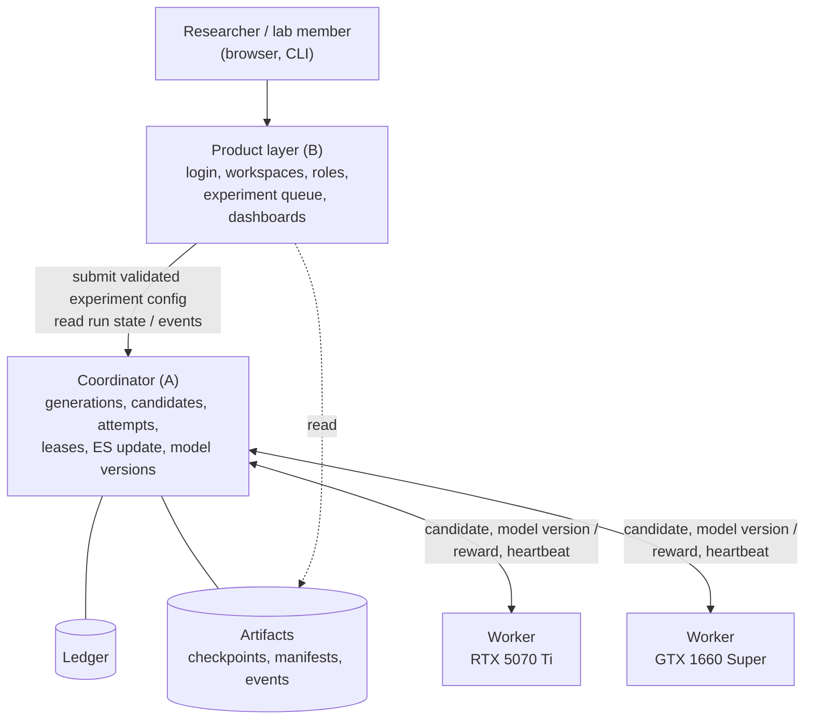
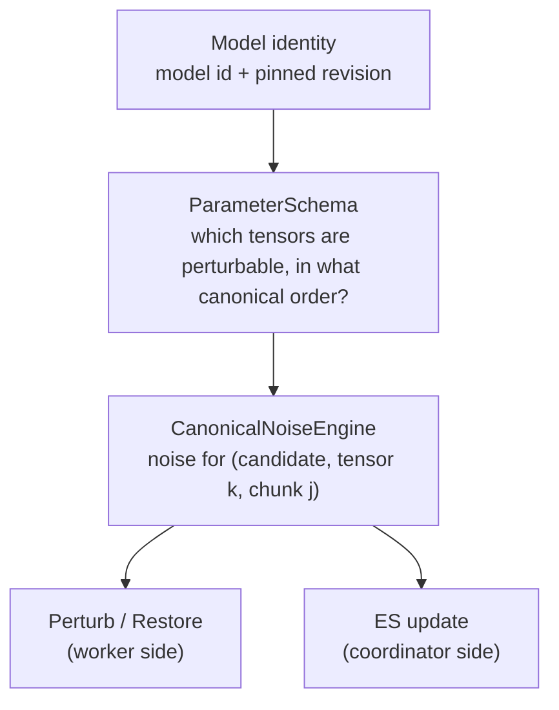
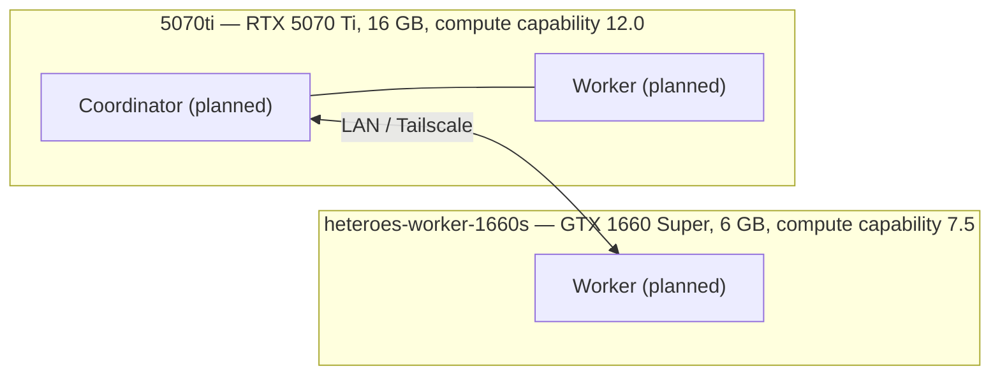

# HeteroES-LLM — Architecture

> **Status:** draft v0.1, 2026-09-30 — written by Claude for review, not yet approved.
> **Audience:** the project team (A — Systems/Core, B — Product/Application).
> **Scope:** the big picture only. Exact numerical rules live in [numerical-contract.md](numerical-contract.md).
> **Sources of truth:** `HETEROES_LLM_MASTER.md` = what the system should be; `HETEROES_LLM_STATUS.md` = what is verified right now. If this file disagrees with them, they win.

## 1. Problem

A small lab owns a few consumer GPUs bought at different times: different VRAM, speed and architecture, connected by ordinary networks (same LAN, or Tailscale between sites). Several lab members want to share this pool to post-train a small LLM with Evolution Strategies (ES).

ES fits this setting:

- Each generation evaluates N perturbed copies of the model ("candidates") **independently** — candidates never talk to each other.
- Each candidate produces **one number** (a reward).
- Each worker holds a full copy of the model; we never split one model across GPUs.

The ES math is well known and is not our contribution. The hard part is making a distributed run **correct and measurable** on mismatched machines. The project is organized around four questions:

| ID | Question | Topic | Familiar analogy |
|---|---|---|---|
| C1 | Who may / should work? | Admission | Adding a server to a pool: "it can run the job" ≠ "adding it makes the pool faster" |
| C2 | Who gets which work? | Execution policy | Job dispatch / load balancing. Compared against known baselines, not claimed as new |
| C3 | Which result is valid? | Candidate / attempt / lease correctness | Idempotent payment processing: a retried request must not charge twice |
| C4 | Which model state is canonical? | Sync / replay | One source of truth + replicas that must stay consistent |

**Not goals:** a new ES algorithm, a new scheduling algorithm, public SaaS, billing, enterprise SSO, model sharding, untrusted volunteer compute.

## 2. One ES generation, end to end

Notation: θ_t = parent model weights at version t (494,032,768 numbers for Qwen2.5-0.5B). σ = noise scale (provisionally ~1e-3). N = candidates per generation.

```mermaid
sequenceDiagram
    participant C as Coordinator
    participant W as Worker
    C->>C: 1. pick N candidate seeds s_1..s_N
    C->>W: 2. candidate i (seed s_i, sigma, model version t)
    W->>W: 3. eps_i = NoiseEngine(s_i), about 494M Gaussian numbers
    W->>W: 4. perturb: theta = theta_t + sigma * eps_i
    W->>W: 5. run the prompt set, score it, get reward R_i
    W->>W: 6. restore theta_t exactly and verify
    W->>C: 7. reward R_i (a few bytes)
    C->>C: 8. standardize rewards into z_i, once; write the update record (seeds, rewards, z, alpha) into the ledger
    C->>C: 9. regenerate eps_i = NoiseEngine(s_i) for every candidate
    C->>C: 10. theta_t+1 = theta_t + (alpha/N) * sum(z_i * eps_i), in FP32
    C->>C: 11. mark the update applied (child weights hash); publish model version t+1
```

Steps 8–11 run on the coordinator or on a designated "update executor" machine (currently planned: the 5070 Ti). The record written in step 8 comes BEFORE the weights change, so that a crash between step 10 and step 11 cannot make the update happen twice (ADR-002, numerical contract §13); the same record is also the small message (hundreds of bytes) that a worker in *replay* mode would apply instead of downloading the new weights.

### Why numerical reproducibility is a correctness problem here

The worker sends back **only R_i, never ε_i**. One ε_i in FP16 is ~1 GB (494,032,768 × 2 bytes), so shipping it is not practical. Instead the coordinator **regenerates** ε_i from the seed in step 9.

Step 10 pairs reward R_i with direction ε_i. If the coordinator's ε_i differs from the one the worker actually evaluated — even slightly — the update pushes the model in a direction that was never measured. **Nothing crashes. Training is silently wrong.**

So "same inputs → bit-identical noise on every machine" is not an optimization; it is the contract that makes distributed ES correct. Physical probes showed that native CUDA RNG (`torch.randn_like` on the GPU with the same seed) **breaks** this contract between the 5070 Ti and the 1660 Super, even with matched PyTorch/CUDA versions (STATUS §5). That is why the Numerical Core (section 5) exists and why it is built first.

Analogy: a client and a server that must independently compute the same hash of a request. If their implementations disagree, requests are silently mismatched.

## 3. System context



Network: ordinary IP (LAN or Tailscale). SSH is for setup, debugging and administration only — never the runtime dispatch mechanism.

## 4. Major components

| Component | Responsibility | Owner | Exists today? |
|---|---|---|---|
| Product layer | Users, workspaces, roles (Admin/Researcher/Viewer), experiment metadata, non-preemptive experiment queue, dashboards, artifact browser | B | No (B starts from mock contracts) |
| Coordinator | Runs one experiment: admission (C1), candidate dispatch (C2), lease/result validation (C3), ES update, publishing model versions (C4) | A | No |
| Worker | Holds a model replica at an assigned version; perturb → evaluate → restore; reports reward + diagnostics. Has no optimizer of its own | A | Only the logic of one candidate (`eval/candidate.py`, `scripts/run_one_candidate.py`); no service, no protocol yet |
| Numerical Core (`src/heteroes/`) | Library: ParameterSchema, CanonicalNoiseEngine, perturb/restore, reward standardization, ES update, manifest, generation record | A | Implemented and tested (schema, noise engine, perturb, snapshot/restore, standardization, update from rewards or from given coefficients, manifest v1, generation record v1); checked on both machines for one candidate (06/10) |
| Ledger (`src/heteroes/ledger/`) | Durable record of generations, candidates, attempts, leases, commits/rejections, failures, quarantine and the update record (SQLite, WAL) | A | Implemented and tested for one coordinator process, with fake workers (06/10, ADR-002); no HTTP, not run on the 1660S |
| Artifact store | Checkpoints, manifests, events, regression evidence | A writes, B reads | Probe evidence only (`artifacts/probes/`) |

Two boundaries worth remembering:

- **The Numerical Core is a library imported by both Worker and Coordinator.** The worker uses it to create ε_i; the coordinator uses the *same code* to recreate ε_i. There must be exactly one implementation — two implementations that "should" agree is exactly how the CUDA RNG problem would come back.
- **Product queue ≠ candidate scheduler.** The product queue decides which *experiment* may start. Once an experiment runs, which *candidate* goes to which GPU is the coordinator's job. The product layer may display runtime state but never changes leases, commits or model versions.

## 5. Numerical Core — and why ParameterSchema comes first

The core is a chain of dependencies. Each layer can only be defined once the layer above it is fixed:



### 5.1 ParameterSchema

The NoiseEngine does not receive a tensor. It receives an **address**: "candidate seed 42, parameter index 17, chunk 3". Two different machines must agree on what "parameter 17" means. ParameterSchema is that agreement: an ordered list of entries `(index, canonical_name, aliases, shape, dtype, numel)`, plus a hash of the whole list.

- **Analogy:** a database schema or an API contract version. If client and server disagree on the schema, you want a loud error, not silently reading the wrong column. The schema hash is part of the noise address, so a mismatch shows up as a detectable identity difference instead of silently wrong noise.
- **Tied (aliased) weights:** one tensor can be reachable under two names. In Qwen2.5-0.5B the probes found exactly one such group: `model.embed_tokens.weight` and `lm_head.weight` are the same tensor. The schema must list it **once**; otherwise the same memory would be perturbed twice and updated twice. This tensor alone holds 136,134,656 elements (~28% of the model).
- **Schema ≠ weights.** The schema describes the *shape* of the parameter space, not its values. A fine-tuned checkpoint has the same schema hash as the base model. Weight identity comes from model id + revision + model version.
- **No runtime addresses in identity.** `id(param)` or `data_ptr()` may be used inside one process to discover aliases, but are never stored or hashed — they change on every run.

### 5.2 CanonicalNoiseEngine

A pure, deterministic function:

```text
(schema hash, engine version, candidate seed, parameter index, chunk index, chunk size)
        → exact bytes of Gaussian noise for that chunk
```

v1 recipe (`numpy_pcg64_normal_f32_to_f16_v1`): SHA-256 of the address → seed a CPU NumPy PCG64 generator → standard normals in FP32 → cast to FP16. It runs on the CPU, so GPU architecture cannot influence it. A full-model probe produced byte-identical noise on both machines.

- **Why chunks:** each tensor is split into fixed-size chunks (262,144 elements in v1; 2,105 chunks for the whole model) and each chunk gets its own seed from its own address. Any chunk can be generated on its own, in any order, so worker and coordinator can process tensors in different orders or memory budgets and still get the same bytes. The chunk size is part of the contract: changing it changes the noise.
- **What must NOT affect the noise:** worker id, attempt id, lease, retry count, reward, workload, arrival time. A retry on a different GPU must rebuild exactly the same candidate.
- **Cost:** generating one full-model noise vector on CPU took 4.3 s on the 5070 Ti host and 18.1 s on the 1660S host in the probe (timing includes hashing). This is a real cost the design must account for; see ADR-001.

### 5.3 Perturb, restore, update (summary)

- **Perturb:** θ_t + σ·ε in the model dtype (FP16 for the current physical baseline).
- **Restore:** copy θ_t back from a snapshot and verify it is bit-identical. Not "subtract the noise again" — in floating point, (x + a) − a is not guaranteed to equal x.
- **Update:** accumulate Σ z_i·ε_i in FP32, cast to FP16 once, and check what was actually applied. Equal rewards → logged no-op. NaN/Inf reward → reject, never replace with 0. The coefficients z_i are computed once by the coordinator and then travel in the generation record; `apply_coefficients_` applies given coefficients, `apply_es_update_` is the standardization followed by it (when a reward equals the mean, its coefficient is `0.0` or a residue of about `1e-16` depending on the order of the sums, so nobody recomputes it; numerical contract §7, §13).

## 6. Identity layers

Several kinds of "identity" exist; mixing them up is the most common source of confusion.

| Identity | Answers | Determined by | Must NOT depend on |
|---|---|---|---|
| Model | Which weights? | Model id + revision + model version t | — |
| Schema | What is the layout of the parameter space? | Names, order, shapes, dtypes, alias map | Weight values, memory addresses |
| Noise | Which exact Gaussian numbers for this chunk? | Schema hash, engine version, seed, parameter index, chunk index, chunk size | Worker, attempt, lease, retry, reward, workload, time |
| Candidate | Which logical ES candidate? | Parent model version, seed, noise recipe, σ, workload, generation config | Which worker ran it, how many retries |
| Attempt | Which execution try of a candidate? | Candidate + a new attempt number + lease (random token) | — (a new one on every retry) |
| Update | Which update turns the parent weights of a generation into the child weights? | Recipe hash, parent weights hash, seeds, rewards, coefficients, alpha (the generation record; its hash) | The child weights (an outcome, recorded apart) |

Note that σ is part of the **candidate**, not the **noise**: the same noise with a different σ is a different perturbed model.

**Candidate vs attempt** (the key C3 idea): a candidate is the logical job, like an order id; an attempt is one try at executing it. A retry keeps the same candidate (same seed, same noise, same workload) but gets a new attempt id and a new lease, possibly on another worker. The coordinator commits **at most one** result per candidate — duplicates and stale attempts are rejected. In the ledger the lease carries a random token that a result must bring back; the latest attempt may still deliver after its deadline as long as nobody was given the candidate in the meantime (ADR-002).

## 7. State ownership

Rule of thumb: whoever owns a piece of state is the only one allowed to change it; everyone else reads a projection of it.

| State | Owner | Notes |
|---|---|---|
| Canonical model version | Coordinator / update executor | The only writer of weights. Workers never publish weights |
| Generation, candidate, attempt, lease, commit/reject, failure, quarantine | Coordinator + ledger | Correctness state. Never owned by the product layer |
| Update record of a generation (inputs) and its outcome (child hash) | Coordinator + ledger | Written before the weights change, marked applied after; at most one per generation |
| Worker capability / admission profile | Coordinator (measured on the worker) | |
| Worker model replica | Worker, at a version assigned by the coordinator | |
| Temporary perturbed weights | Worker | Exist only between perturb and restore; must return to θ_t exactly |
| Users, workspaces, roles, experiment metadata, experiment queue | Product layer | |
| Artifacts (checkpoints, manifests, events) | Coordinator writes; product indexes and reads | |

## 8. Current deployment



- The 5070 Ti machine holds the primary repository and is where development happens. The 1660S runs **the same Git commit**; no separate development there.
- Traffic falls into two planes:
  - **Control plane** — small messages: candidate descriptors, leases, rewards, heartbeats. Needs reliability, not bandwidth.
  - **Data plane** — large payloads: model checkpoints (~1 GB in FP16), full synchronization. Network speed changes the *cost* here, never the *correctness*; C4 measures that cost.

## 9. Mapping to familiar architectures

If you know web development (MVC, REST, microservices), HeteroES has **two layers** that feel different:

- **The product layer is an ordinary web application.** MVC, REST API, a database of users and experiments — everything you already know applies.
- **The compute layer is a coordinator–worker system**, a different family from microservices. MVC answers "how do I organize code inside one app"; microservices answer "how do I split a large product into services by business area". Coordinator–worker answers "how do I split one heavy computation across many machines and combine the results correctly".

| HeteroES concept | Familiar equivalent |
|---|---|
| Generation | One batch job: split into N independent pieces, run them in parallel, then combine the results (the classic "map, then reduce" pattern) |
| Coordinator | A background-job scheduler plus its `jobs` table |
| Worker | A background-job worker or a CI runner: take a job, run it, report the result |
| Candidate | A logical job with a stable id, like an `order_id` |
| Attempt | One execution try of that job; a retry is a new attempt of the same job |
| Lease | A time-limited claim on a job ("visibility timeout" in message queues): if the worker goes silent, the job becomes available again |
| At most one committed result per candidate | Idempotent payments: a retried request must not charge twice |
| Ledger | A transactions table |
| Numerical Core | A shared library / SDK imported by several programs — not a service |
| ParameterSchema | A database schema or API contract version |

Four things make this system different from a typical web backend:

1. **Workers are stateful, heavy and unequal.** A stateless web service scales by adding identical instances behind a load balancer. Here every worker holds a ~1 GB model in GPU memory, and the workers are *not* identical (16 GB fast vs 6 GB slow). That is why C1 (should the slow machine join?) and C2 (how to split work?) exist.
2. **There is a synchronization barrier.** A web server handles each request independently. Here the update needs **all N** candidate rewards first, so one slow machine can delay the whole generation.
3. **Retries and network failures are normal.** This is the at-least-once delivery + idempotency problem found in payment systems and message queues. C3 must get it right.
4. **The same function can give different results on two machines.** In a web backend `1 + 1` is `2` everywhere. With floating point on different GPUs that is not guaranteed — the probes measured different noise from the same seed. Because the coordinator must recreate the noise the worker used, this is a correctness risk, not a performance detail. It is why the numerical contract comes before networking.

## 10. Why coordinator–worker (alternatives considered)

| Alternative | What it means | Why not the default here |
|---|---|---|
| **Peer-to-peer, no coordinator** | Every worker broadcasts its reward to every other worker and each one computes the update locally (the approach of the 2017 OpenAI ES paper) | No single referee decides which result is valid, so retries and failures (C3) become much harder; the weak 1660S must also compute every update; replicas can drift. The idea is not discarded: it is the **replay** mode that C4 will measure, with the coordinator still the source of truth |
| **An existing framework (Ray)** | Use Ray's task scheduling and retries; ES-at-Scale does this | Ray's retry means "run the task again"; it has no notion of candidate / attempt / lease and does not prevent a reward from being committed twice, so that logic must be written anyway. Running Ray across Tailscale between machines with different Python versions (3.12 vs 3.14) is added risk. MASTER keeps Ray as an ADR-gated option, not the default. This decision belongs after the numerical gate |
| **A job queue (Celery / Redis)** | Use an off-the-shelf queue for dispatch | Same issue: queues give at-least-once delivery, idempotency is still ours to build. Adds infrastructure to operate. MASTER: no Redis without a concrete need |
| **Asynchronous ES** | Do not wait for all N candidates; apply results as they arrive | Results computed on an older model version ("stale") complicate both the math and correctness. Kept as future work in MASTER |

**Known weakness of the chosen design:** the coordinator is a **single point of failure** — if it dies, the run stops. For a two-machine lab this is an accepted trade-off. Coordinator restart / recovery is a SUPPORTING item in MASTER, and the CLI must state clearly what is and is not recoverable.

**Bottom line:** the coordinator–worker shape is common and not a contribution. The value is in the **contracts** inside it: portable noise across GPUs, exactly-once candidate commits, and measured admission and synchronization decisions.

## 11. Current implementation boundary (updated 2026-10-07, after G6)

**Verified** (evidence in STATUS 0.0 and `artifacts/`):

- Single-GPU ES reference (notebook) runs end-to-end on both GPUs in FP16.
- Exact snapshot restore (max diff 0.0) on both.
- Native CUDA RNG gives different noise across the two GPUs → rejected as the canonical noise source.
- NoiseEngine v1: identical noise bytes over the full model on the 5070 Ti, the 1660S, a Colab T4 and a Kaggle T4.
- Perturbation arithmetic (O2 = option c): identical perturbed-weight hash on the same four environments.
- **The numerical gate (steps 1 to 9) is closed for one candidate** (06/10): the same candidate (seed 0, sigma 1e-3) gives identical weights and identical outputs on the 5070 Ti and the 1660 SUPER; manifest v1 frozen.
- A first short learning experiment on one GPU (06/10): a signal, not a proof (`artifacts/experiments/2026-10-06-learning-pilot/`).
- **The ledger (06/10, steps G2a to G2f), on the 5070 Ti only, for one coordinator process:** generations, candidates, attempts, leases with lazy expiry, results (idempotent, conflicting ones refused), typed failures, retry budget, quarantine of a worker whose restore failed, generation state computed (OPEN / COMPLETE / FAILED), results in index order for the update, and the write-ahead update record. Tests: unit tests, a model of the contract that predicts every action, the six scenarios of MASTER §22.4 on simulated time, random schedules, every order of small alphabets, two dispatch policies on unequal fake workers. Why and how: ADR-002.
- **G3, the distributed runtime on the two physical machines (06/10, evening):** an HTTP coordinator and pull workers (stdlib HTTP server and client, shared token, idempotent retries), the dispatch policies B3 greedy and B1 static-wave, worker admission by recipe hash and noise fingerprint, full synchronization by downloading the weights file named after its SHA-256 (hash checked before the model is touched), a write-ahead update record, and a ledger safe for threads. A coordinator and a worker on the 5070 Ti and a worker on the 1660S (a direct gigabit cable) ran 8 candidates for 3 generations under both policies; every reward and every weights hash is bit-identical to the single-process reference (`artifacts/experiments/2026-10-06-g3-two-machines-cable*/`, STATUS 0.0). No speedup is claimed: those runs were slower than the single process.

- **G4 and G5 (07/10): C1 admission, the proportional baseline B2, and a benchmark of B0 to B3 with three repeats** (`artifacts/experiments/2026-10-07-g4-*`, `2026-10-07-g5-benchmark/`). What it showed, after the audit of the same day re-read it: B1 (static waves) is clearly the worst; the cluster of two GPUs was NOT faster than the fast GPU alone once generation 0 (where the remote worker does not synchronize) is left out; a 10 times slower GPU can add at most about 10 percent, and the coordinator's update and the synchronization took the rest.
- **G6 (07/10), after the audit: speed, durability and a study of the cross-GPU differences** (STATUS 0.000, ADR-002 "Amendments", numerical contract sections 13 to 15): the noise is generated on a thread pool with the order of the arithmetic unchanged (update of 8 candidates 44.9 s -> 2.4 s, perturbation 3.7 s -> 0.75 s on the 5070 Ti, identical bits); the coordinator can be restarted (`Coordinator.recover`) and ends an experiment with the weights of an uninterrupted run; leases are short and kept alive by a heartbeat; a lease request can be repeated safely; the HTTP server has a socket timeout, a connection limit and requires a token off loopback; the weights download resumes; a worker's reward that could not be delivered is kept and delivered later; the published weights are pruned. On the two real machines (`artifacts/experiments/2026-10-07-g6-failure-campaign*/`): a worker killed while it held a candidate, a worker stopped past its lease, the link cut (8 s, 80 s, in the middle of a download, which then resumed from the byte where it had stopped) and the coordinator killed and restarted with `--resume` all ended with exactly the weights of the undisturbed run. Benchmarks (`2026-10-07-g6-benchmark-*`): a generation of N = 24 takes 29 s with the FP32 evaluation (221 s in G5), the 1660S adds 0 to 2.4 percent with greedy or tail-aware dispatch (FP16: greedy -6 percent, tail-aware +6 percent); with the FP32 forward pass the two GPUs gave the same answers to all 1,920 prompts of a 120-candidate sweep and all 20 benchmark runs ended with identical weights.

**Not verified / not done:** one hardware pair and one workload of 16 prompts; one run per failure scenario; the token travels in clear (private link only, and now required off loopback); worker ids are free strings (no registry); the network set-up of the two machines (cable addresses, one ufw rule) is by hand and not in the repository; the evaluation in FP16 gives a different answer for a prompt in about 1 percent of the candidates when it runs on another GPU or in a padded batch, and the forward pass in FP32 removed it in every padding test (see STATUS 0.000 and the evidence folder `2026-10-07-g6-cross-gpu`): it is not the production evaluation and no decision to adopt it was taken; no measurement of full sync against replay on a faster CPU than the 1660S's (on it, replaying N candidates costs about 3.7 s each against a 10 s synchronization, so replay loses from N = 3); no learning claim with the distributed runtime.

**Next, in order:** decide the evaluation precision (FP32 forward pass: cost against agreement between GPUs) -> a workload whose rollout is long enough for the slow GPU to matter -> learning experiments on the runtime -> the report.

## Glossary

| Term | Meaning |
|---|---|
| Generation | One ES step: evaluate N candidates, then produce model version t+1 |
| Candidate | One logical perturbation θ_t + σ·ε_i of the parent model |
| Attempt | One execution try of a candidate on a worker |
| Lease | Time-limited ownership of an attempt by a worker; expires if the worker goes silent |
| Token | Random proof that an attempt holds its lease; a result must bring it back, so an old attempt cannot commit |
| Ledger | The coordinator's durable record (SQLite) of what was given to whom and what was accepted |
| Quarantine | A worker whose restore failed is put aside: no new leases, no new results, until a human releases it |
| Generation record | The inputs of one update (seeds, rewards, coefficients, alpha, recipe and parent hashes); written before the weights change |
| Coefficients | The numbers z_i that weight each candidate's noise in the update; computed once by the coordinator and shipped with the record |
| Seed | Integer that, with the schema and engine version, fully determines a candidate's noise |
| σ (sigma) | Noise scale: how far candidates move away from the parent |
| Chunk | Fixed-size slice of a parameter tensor; the unit of noise generation |
| Canonical | The single agreed-upon version of something (weights, noise bytes, schema) that all machines must match |
| Schema hash | Fingerprint of the parameter layout, used to detect layout mismatches |
| Full sync | Coordinator sends the whole new model to every worker after each generation |
| Replay | Workers rebuild θ_{t+1} locally from seeds + coefficients instead of downloading it |
