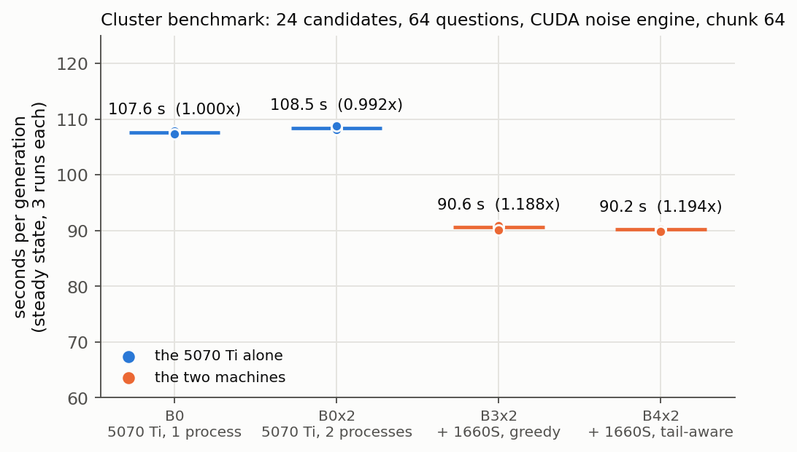
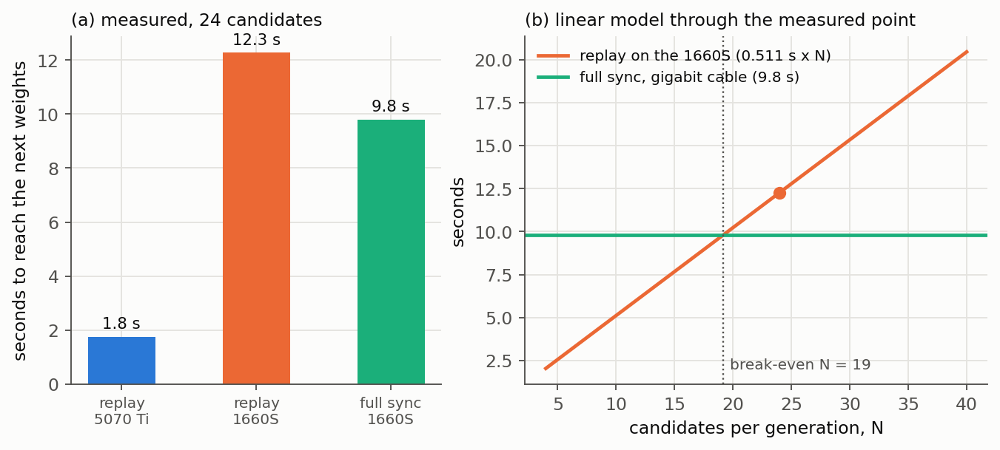
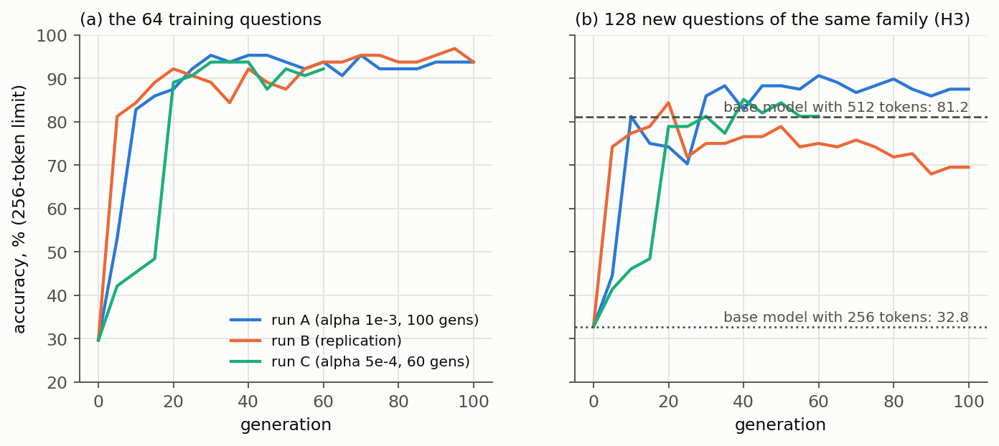
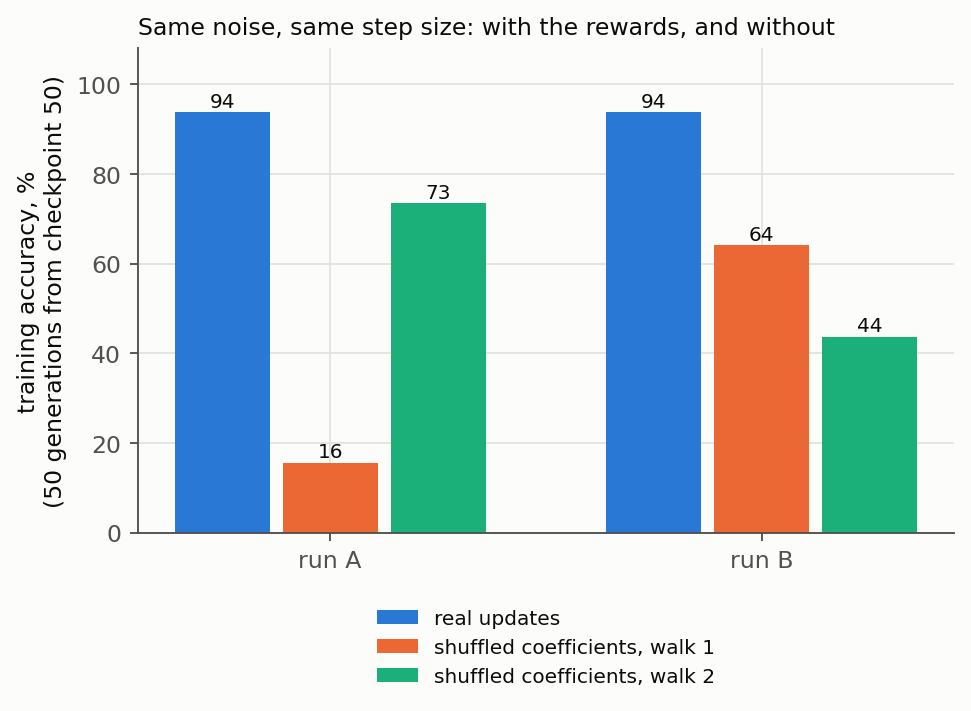
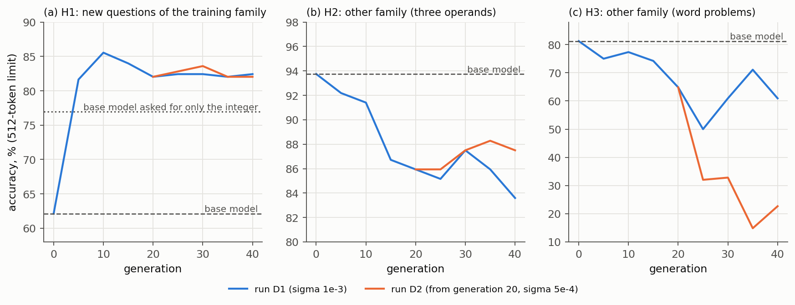

# HeteroES-LLM — Báo cáo kỹ thuật (bản nháp)

> **Trạng thái:** bản nháp do AI viết ngày 2026-10-08 để bạn (chủ dự án, track A) đọc và sửa. **Chủ dự án chưa review.** Mọi con số đều trỏ về file bằng chứng trong `artifacts/`; con số nào là suy luận thì được ghi là suy luận.
> **Phạm vi:** track Systems/Core (A). Phần Product/Application (B) không nằm trong báo cáo này vì repo không có bằng chứng về nó.
> **Nguyên tắc claim** (MASTER §3, §12): không nói hơn bằng chứng. Ô nào chưa chạy ghi `NOT_RUN`; không điền số từ bài báo khác vào cột số đo của nhóm.
> **Hình:** `docs/report/figures/` (dựng bằng `docs/report/make_figures.py` trực tiếp từ artifact thô).

## 0. Tóm tắt

HeteroES-LLM là một runtime huấn luyện sau (post-training) kiểu Evolution Strategies (ES) đồng bộ cho cụm GPU tiêu dùng không đồng nhất: một RTX 5070 Ti (16 GB) và một GTX 1660 SUPER (6 GB), nối bằng cáp trực tiếp. Mô hình dùng là Qwen2.5-0.5B-Instruct. Dự án **không** đề xuất thuật toán ES mới hay thuật toán lập lịch mới; đóng góp là làm cho việc chạy ES trên máy không đồng nhất **đúng, tái lập được và đo được**.

Kết quả chính, mỗi ý có bằng chứng ở mục tương ứng:

1. **Tính đúng đắn số (mục 3).** Nhiễu, cập nhật và khôi phục cho kết quả giống từng bit trên hai GPU khác nhau. Replay 100 cập nhật liên tiếp từ mô hình gốc trên cả hai máy cho hash trọng số trùng 100/100 lần với hash mà máy huấn luyện lưu (không có trôi).
2. **Chịu lỗi (mục 5).** Sổ cái SQLite, lease, loại kết quả muộn, khởi động lại coordinator; bốn nhóm lỗi đã chạy trên hai máy thật, mọi lần kết thúc với đúng trọng số của lần chạy không bị nhiễu (mỗi kịch bản chạy một lần).
3. **Điều phối (mục 4).** Với GPU chậm hơn 4–7 lần, điều phối tham lam thuần túy có thể làm cụm **chậm hơn** GPU nhanh đứng riêng; chính sách tránh đuôi (B4) cho cụm nhanh hơn 1,19 lần (±0,012), gần trần lý thuyết 1,23.
4. **C4 (mục 6).** Replay một thế hệ N = 24 mất 12,3 s trên 1660S, so với 9,8 s đồng bộ đầy đủ qua cáp gigabit; replay chỉ có lợi khi N dưới khoảng 19 hoặc khi băng thông dưới khoảng 720 Mbit/s.
5. **Học (mục 7 và 8).** Lần thứ nhất (ba run): không có bằng chứng học theo tiêu chí đã đăng ký, và điểm tăng lớn phần lớn là mô hình học trả lời ngắn lại cho kịp giới hạn 256 token. Lần thứ hai (không còn bị cắt token): điểm held-out trên họ huấn luyện tăng mạnh (62,1% → 84,0%) và hướng cập nhật có tác dụng so với đối chứng ngẫu nhiên, nhưng phần lớn mức tăng là chuyển sang trả lời thẳng (mô hình gốc được yêu cầu trả lời thẳng đã đạt 77,0%), và các họ khác bị thiệt hại.

Các con số "nhanh hơn" khiêm tốn (vài chục phần trăm), và có một cặp phần cứng, một mô hình, N = 24. Xem mục 9 về giới hạn.

## 1. Bài toán và đóng góp

Một phòng thí nghiệm nhỏ có vài GPU tiêu dùng mua vào các thời điểm khác nhau. ES phù hợp vì mỗi thế hệ đánh giá N bản sao nhiễu của mô hình **độc lập** (không cần liên lạc giữa chúng), mỗi bản chỉ trả về **một số** (phần thưởng), và mỗi worker giữ nguyên một bản mô hình. Khó khăn không nằm ở toán ES mà ở chỗ phải chạy **đúng và đo được** trên máy lệch tốc độ và có thể sập.

Bốn đóng góp kỹ thuật (MASTER §4), đều là kỹ nghệ chứ không phải thuật toán mới:

| ID | Nội dung | Bằng chứng trong báo cáo |
|---|---|---|
| C1 | Năng lực worker, chunk an toàn, nhận worker theo lợi ích | mục 4 (một phần, xem giới hạn) |
| C2 | Chính sách điều phối so với các đối chứng B0–B4 | mục 4 |
| C3 | Đúng đắn ứng viên/lần thử/lease khi có lỗi | mục 5 |
| C4 | Trạng thái chuẩn: đồng bộ đầy đủ và replay | mục 3 và 6 |

## 2. Hệ thống (tóm tắt kiến trúc)

Chi tiết ở `docs/architecture.md`. Một **thế hệ** gồm: coordinator mở thế hệ với N ứng viên (mỗi ứng viên có một seed), các worker kéo việc (pull) qua HTTP, mỗi worker cộng nhiễu theo seed vào bản sao của trọng số cha, chấm điểm, **khôi phục chính xác** về trọng số cha, và gửi lại một con số. Coordinator chuẩn hóa phần thưởng (z-score), tính hệ số, ghi **bản ghi cập nhật** (seed, hệ số, alpha, có hash) vào sổ cái *trước khi* đụng đến trọng số, áp dụng cập nhật rồi công bố trọng số con dưới dạng `<sha256>.bin`. Worker lệch phiên bản đồng bộ lại (đồng bộ đầy đủ). Sổ cái SQLite giữ ứng viên, lần thử, lease và bản ghi cập nhật.

Hai engine nhiễu: engine CPU chuẩn (mặc định, chạy trên mọi máy) và engine CUDA (tùy chọn, giống từng bit trên hai GPU, cần GPU ở cả coordinator). Việc đánh giá chạy ở FP32 theo mặc định (quyết định O8).

## 3. Tính đúng đắn số

**Vấn đề.** Nếu hai máy tạo ra nhiễu hoặc điểm khác nhau cho cùng một ứng viên thì kết quả của cụm phụ thuộc vào máy nào chấm ứng viên nào: không tái lập được.

**Kết quả (đều đã đo; xem README từng thư mục):**
- *Nhiễu và cập nhật giống từng bit trên hai GPU.* Engine CPU chuẩn đã khớp qua bốn môi trường (5070 Ti, 1660S, Colab T4, Kaggle T4) (`artifacts/regression/2026-10-03-o2-perturbation/`). Engine CUDA, trên mô hình thật, cho hash trọng số sau nhiễu, khôi phục và cập nhật giống nhau trên hai GPU (`artifacts/experiments/2026-10-07-g7-restore-tradeoff/`).
- *Nguồn gốc lệch kết quả giữa hai GPU.* Khi đánh giá ở FP16 thì 33/120 ứng viên (27,5%) cho văn bản trả lời khác trên GPU kia (36/1.920 prompt) và 1 ứng viên cho phần thưởng khác; với FP32, 0/1.920 prompt khác và 0 phần thưởng khác (`artifacts/experiments/2026-10-07-g6-cross-gpu/`). Vì vậy FP32 là mặc định. Đó là mức đã kiểm tra (khoảng 0,2% mỗi câu ở độ tin cậy 95%), không phải bảo đảm.
- *Replay 100 cập nhật không trôi (mới, 08/10).* Từ trọng số gốc, áp lần lượt 100 bản ghi cập nhật của một lần chạy học trên mỗi máy: hash trọng số sau **từng** thế hệ khớp hash lưu trong sổ cái ở 100/100 trường hợp trên cả 5070 Ti và 1660S, và 20/20 checkpoint (`artifacts/experiments/2026-10-08-c4-replay/README.md`). Một bản ghi chỉ nặng 1,4 KB.
- *Dựng lại từ bản ghi.* Trong phân tích offline của ba lần chạy học, 52/52 đoạn (mỗi đoạn là 5 thế hệ) dựng lại từ bản ghi khớp hash checkpoint tiếp theo.

**Giới hạn.** Chỉ một cặp GPU và một bộ phần mềm (torch 2.13.0+cu132, transformers 5.17.0 trên cả hai máy). Engine CUDA cần GPU ở coordinator; chưa có engine thay thế cho coordinator không có GPU.

## 4. Thực thi và điều phối (C1, C2)

**Điều kiện đo** (`artifacts/experiments/2026-10-07-g7-bigchunk/`): N = 24 ứng viên, 4 thế hệ mỗi lần chạy, 3 lần chạy mỗi điều kiện, engine CUDA, workload 64 câu, chunk 64. T là số giây mỗi thế hệ ở trạng thái ổn định (bỏ thế hệ đầu).



| Điều kiện | T (s) ± khoảng tin cậy 95% | Tăng tốc so với B0 |
|---|---|---|
| B0: 5070 Ti, 1 tiến trình | 107,6 ± 0,6 | 1,000 |
| B0x2: 5070 Ti, 2 tiến trình | 108,5 ± 0,8 | 0,992 ± 0,009 |
| B3x2: thêm 1660S, tham lam | 90,6 ± 1,0 | 1,188 ± 0,015 |
| B4x2: thêm 1660S, tránh đuôi | 90,2 ± 0,8 | 1,194 ± 0,012 |

Cả 12 lần chạy cho cùng phần thưởng và cùng hash trọng số cuối (`summary-cot_l3_q64-chunk64.json`: `identical_rewards_and_hashes: true`). Máy 1660S làm 16/96 ứng viên của một lần chạy; trần lý thuyết của mọi cách lập lịch là 1,23.

**Điều đã học trên đường đi** (STATUS, mục G5–G7): kết luận "B3 nhanh hơn 3,5%" của G5 là hiệu ứng của thế hệ 0; với GPU chậm, B3 tham lam ở N = 24 cho 0,941 ± 0,030 so với GPU nhanh một mình trong cấu hình FP16, còn B4 cho 1,060 ± 0,046. Một thế hệ N = 24 từ 221 s (G5) xuống 29–36 s (G6, FP32) và khoảng 90 s với workload dài hơn (G7); các con số này thuộc workload khác nhau và không so trực tiếp được.

**C1 (admission).** Profile worker, chunk an toàn và cổng kiểm tra phiên bản phần mềm đã làm. Thí nghiệm dự đoán lợi ích (admission so với ép nhận) **chưa được lặp lại** sau G6: với cặp này, câu hỏi thực tế là "nhận worker kèm chính sách tránh đuôi, hay không nhận", với lợi ích 0–6%.

## 5. Đúng đắn khi có lỗi (C3)

Chiến dịch lỗi chạy trên hai máy thật (`artifacts/experiments/2026-10-07-g6-failure-campaign/`, N = 8, 3 thế hệ): `kill -9` worker đang giữ ứng viên; dừng worker quá thời hạn lease; cắt liên kết (8 s; 80 s; một lần đứt giữa lúc tải xuống, tải tiếp từ byte đã nhận); `kill -9` coordinator giữa thế hệ rồi `--resume`. Mọi kịch bản kết thúc với đúng trọng số của lần chạy không bị nhiễu, mỗi ứng viên một kết quả. Kết quả muộn bị từ chối vì quá hạn. **Mỗi kịch bản chỉ chạy một lần**, và chưa kill coordinator giữa lúc ghi bản ghi và lúc áp dụng trên máy thật (test làm điều này với hai đối tượng coordinator).

Một sự cố thật ngoài kế hoạch: máy 1660S mất liên lạc hai lần (theo chủ dự án là lỗi liên quan GPU/PCIe, nghi là tiếp xúc lỏng; **chưa xác minh bằng log**) trong đợt chạy học ngày 08/10 (sau mỗi lần phải khởi động lại). Hệ thống tiếp tục với 5070 Ti và kết quả không đổi (sổ cái ghi mỗi kết quả đúng một lần), nhưng log của worker trên máy đó bị mất (xem mục 9).

## 6. Đồng bộ đầy đủ hay replay (C4)



(a) Số đo: replay N = 24 trung vị 1,76 s trên 5070 Ti và 12,27 s trên 1660S (100 cập nhật mỗi máy); đồng bộ đầy đủ của 1660S 9,8 s (truyền 8,55 s + nạp 0,51 s + băm lại 0,74 s). (b) Mô hình tuyến tính đi qua điểm đo (0,511 s mỗi ứng viên trên 1660S) cho điểm hòa vốn N ≈ 19 trên cáp gigabit. Đây là phép tính trên các thành phần đã đo, không phải một lần chạy riêng.

Kết luận: trên cáp gigabit, đồng bộ đầy đủ nhanh hơn replay khoảng 20% ở N = 24; replay thắng khi băng thông hiệu dụng dưới khoảng 720 Mbit/s (ví dụ Wi-Fi hoặc đường dùng chung) hoặc khi N nhỏ. Về byte, replay nhỏ hơn khoảng 720.000 lần. Chưa có đường replay tích hợp trong worker (chỉ có script đo), và chưa đo đồng bộ delta nén (ý tưởng trong TODO).

## 7. Thí nghiệm học trên runtime (ba lần chạy, 07–08/10)

**Thiết kế** (`artifacts/experiments/2026-10-07-learning-runtime/`; tiêu chí viết trước trong `PREREGISTRATION.md`): N = 24, sigma 1e-3, workload gồm 64 bài toán lời văn (level 3) với lời giải tối đa 256 token, 100 thế hệ (run A, alpha 1e-3; run B lặp lại với nhiễu khác; run C thăm dò với alpha 5e-4, 60 thế hệ). Giữ checkpoint mỗi 5 thế hệ. Phân tích offline dựng lại từng thế hệ từ bản ghi, đo bước thật (parent+), bước đối chứng ngược `-alpha` (parent-), và ba tập held-out 128 câu (cùng họ H3 và hai họ khác H1, H2).



**Kết quả theo tiêu chí đã đăng ký: cả ba lần chạy là "không có bằng chứng học".** S1 (H3 tăng ít nhất 8 câu) và S3 (độ chính xác train tăng 0,10) đúng; S2 (bước thật thắng bước ngược ở ít nhất 70% thế hệ) sai (44/100, 46/100, 30/60); S4 (không hại họ khác) sai vì H2 (116 → 99, 88, 100 trên 128).

| | Gốc | Run A | Run B | Run C |
|---|---|---|---|---|
| Train (64 câu), % | 29,7 | 93,8 | 93,8 | 92,2 |
| H3 (128 câu), %, giới hạn 256 token | 32,8 | 87,5 | 69,5 | 81,3 |

**Đính chính quan trọng (08/10).** Mô hình gốc, khi được viết tới 512 token, đạt **81,2%** trên H3 (so với 32,8% ở 256 token): 36/64 câu trả lời của mô hình gốc bị cắt ở 256 token và không bao giờ tới dòng `Answer:` (`artifacts/experiments/2026-10-08-uncut-probe/README.md`). Mọi bản nhiễu đều ngắn hơn nên điểm khoảng 72%. Vì vậy phần lớn mức tăng ở 256 token là mô hình học viết ngắn lại. So với mốc đúng 81,2%: run A cao hơn 6,3 điểm (8 câu, cỡ nhiễu), run B thấp hơn 11,7 điểm, run C cao hơn 0,8 điểm. **Không nên trích mức tăng "42 → 112" như bằng chứng ES cải thiện phép tính.**

**Điều vẫn đúng và đáng giá:**
- *Hướng cập nhật có tác dụng khi cộng dồn.*



Từ checkpoint 50, đi 50 bước với hệ số bị xáo trộn (cùng nhiễu, cùng cỡ bước, không liên quan phần thưởng) làm độ chính xác train rơi xuống 16%/73% (run A) và 64%/44% (run B), trong khi các bước thật giữ 94%. Mỗi run chỉ có hai lần đi, nên đây là thăm dò.
- *Điểm bão hòa khiến S2 không đo được.* Từ thế hệ khoảng 30 điểm train chạm 59–62/64 và một phần ba số thế hệ hòa; bỏ các thế hệ hòa, bước thật thắng 44/66 (A) và 46/71 (B). Đây là phân tích sau khi thấy dữ liệu, không phải tiêu chí đăng ký. Tiêu chí S2 do chính mình viết thiếu cách xử lý hòa; đó là lỗi thiết kế tiêu chí, không phải lỗi của ES.
- *Quá khớp.* Run B có H3 đạt 108 ở thế hệ 20 rồi tụt về 89, trong khi train giữ 94%: chỉ 64 câu train cố định.
- *sigma 1e-3 quá lớn cho mô hình đã tốt.* Ở thế hệ 50–99, mô hình cha đạt 93% trên train, còn 24 bản sao của nó trung bình 83%.

## 8. Thí nghiệm học lần hai (không còn bị cắt token)

**Thiết kế** (`artifacts/experiments/2026-10-08-learning-v2/`; tiêu chí viết trước trong `PREREGISTRATION.md`): tập huấn luyện 128 câu level 1 (phép tính hai chữ số; trả lời khoảng 96 token nên không bị cắt; độ chính xác mô hình gốc 64,5% ở cả 256 và 512 token), N = 32, sigma 1e-3, alpha 1,5e-3, 40 thế hệ, 5070 Ti một mình. Tập validation V1 (256 câu) chỉ để chọn checkpoint; tập kiểm tra H1 (256 câu cùng họ) và hai họ khác H2 (ba toán hạng) và H3 (bài toán lời văn), đều đánh giá với giới hạn 512 token; đối chứng đi ngẫu nhiên tích lũy là một phần của tiêu chí P2.



**Kết quả theo tiêu chí đã đăng ký (run D1):**

| Tiêu chí | Số đo | Đạt |
|---|---|---|
| P1: H1 tăng ít nhất 6 điểm (checkpoint chọn theo V1) | 62,1% → 84,0% (+21,9) | có |
| P2: hướng cập nhật quan trọng (≥ 60% các thế hệ không hòa, kiểm định dấu p ≤ 0,05, ba lần đi ngẫu nhiên đều kết thúc thấp hơn) | 22/26 thế hệ không hòa, p = 0,0003; ba lần đi ngẫu nhiên kết thúc ở 87,5%, 77,3%, 83,6% so với 94,5% của quỹ đạo thật | có |
| P3: train tăng ít nhất 8 điểm | 65,6% → 93,0% (+27,3) | có |
| P4: H2 và H3 không giảm quá 6 điểm | H2 85,7% so với 93,8% (−8,1); H3 64,3% so với 81,2% (−16,9) | **không** |

Theo luật viết trước, nhãn là "không có bằng chứng cải thiện trên phép tính held-out" (nhánh cuối của luật). Nhãn này mô tả D1 kém: **điểm trên họ huấn luyện tăng rất mạnh, còn thất bại nằm ở thiệt hại cho các họ khác** (Phụ lục 1 của tiêu chí giải thích).

**Cơ chế (phân tích sau khi thấy dữ liệu, không phải tiêu chí).** Độ dài trả lời trung bình của H1 giảm từ 247 xuống khoảng 95 ký tự: mô hình chuyển sang trả lời thẳng. Mô hình gốc, nếu được yêu cầu "chỉ trả lời số nguyên cuối cùng", đã đạt **77,0%** trên H1 (so với 62,1% với prompt suy luận của workload) (`artifacts/experiments/2026-10-08-direct-answer-probe/`). Checkpoint của D1 với prompt của workload đạt 82–84%, tức hơn mốc đúng khoảng 5–7 điểm (biên giới, khoảng 2 sai số chuẩn), và khi được yêu cầu chỉ trả lời số thì không hơn mô hình gốc (76,6% và 68,8%). **Kết luận có điều kiện:** ES chủ yếu dạy mô hình trả lời theo cách mà mô hình gốc vốn đã làm tốt nhất; còn có học thêm chút tính toán hay không thì run này không tách được.

**D2 (thăm dò, một lần chạy, sigma và alpha đổi cùng lúc):** từ thế hệ 20 của D1, sigma 5e-4 và alpha 7,5e-4, 20 thế hệ. Phần thưởng trung bình của 32 ứng viên ngang cha (93,9% so với 94,4%; trong D1 các thế hệ 20–39 là 89,5% so với 93,7%): hiện tượng "bản sao tệ hơn cha" ở cuối các run lần đầu đã hết. Nhưng H1 không tốt hơn (82,0%, như D1) và H3 tụt thêm (22,7% so với 60,9%). Vậy trong thiết lập này, sigma nhỏ hơn không giúp độ chính xác held-out.

**Điều rút ra cho báo cáo:** (i) hướng cập nhật của ES có tác dụng (đối chứng đi ngẫu nhiên, P2) và nó nhanh chóng tìm ra cách trả lời có điểm cao hơn; (ii) phần lớn mức tăng là chuyển chế độ trả lời, không phải học phép tính; (iii) việc chuyển chế độ gây thiệt hại cho các tác vụ cần suy luận trong văn bản. Một lần chạy, một họ câu hỏi: đây là bằng chứng về cơ chế, không phải kết luận chung về ES.

## 9. Giới hạn và những điều báo cáo này không chứng minh

- **Phần cứng:** một cặp GPU, một mô hình (0,5B), một bộ phần mềm. "Không đồng nhất" ở đây là một ca nghiên cứu, không phải kết luận chung về mọi cụm.
- **Hiệu năng:** tăng tốc 1,19 lần nhờ máy thứ hai, trần 1,23; với N = 24, 3 lần chạy mỗi ô. Chưa thử N = 48 hoặc 96, chưa có chunk riêng cho từng worker, chưa tối ưu vòng giải mã (KV cache tĩnh, CUDA graphs, vLLM).
- **Học:** chưa có bằng chứng ES cải thiện độ chính xác tính toán trên tập held-out sau khi loại ảnh hưởng của giới hạn token (xem mục 7 và 8: mức tăng chủ yếu là đổi cách trả lời). Không so sánh với GRPO hay thuật toán khác.
- **Replay** là script đo, chưa tích hợp vào worker; chưa đo đồng bộ delta nén.
- **Admission (C1):** thí nghiệm dự đoán so với ép nhận chưa lặp lại sau G6.
- **Mất log:** log worker của máy 1660S bị mất ở hai lần chạy học vì máy sập trước khi sao chép; tỷ lệ ứng viên máy đó làm (375/2400, 304/2400) là suy ra từ tổng, không phải đo.
- **Review:** hơn 50 commit từ G6 trở đi do AI viết (test trước, kiểm tra đột biến trên bản sao), chủ dự án chưa review. Bộ test: 1994 passed, 4 skipped trên 5070 Ti.
- **Phần Product (B)** không được báo cáo ở đây.

## 10. Nguồn gốc, quyền sở hữu, tài liệu tham khảo

- **Mã nguồn của dự án:** toàn bộ `src/`, `scripts/`, `tests/` và `artifacts/` trong repo; tài liệu và phần lớn mã do AI viết dưới sự điều hướng của chủ dự án, test trước và kiểm tra đột biến trên bản sao (xem `CLAUDE.md`, phần Working style). MASTER §16.6 yêu cầu ghi rõ cách dùng AI: **phần này cần chủ dự án xác nhận và hoàn thiện** (ai viết phần nào, ai đã review).
- **Công trình liên quan (đã đọc để lấy ý tưởng; không sao chép mã):** *Evolution Strategies at Scale* (Qiu et al., arXiv 2509.24372; N = 30, sigma 0,001, alpha 5e-4, mẫu seed nhiễu, chuẩn hóa z-score); *Understanding Evolution Strategies for LLM Reasoning* (Ba, Zheng et al., arXiv 2608.27351; dịch chuyển tham số lớn nhưng tác động hiệu năng tập trung vào tập nhỏ cập nhật lớn; mô hình lớn cần quần thể nhỏ hơn; z-score quan trọng); *Agentic ESOpt* (Zheng et al., arXiv 2608.17310; lịch giảm sigma kiểu cosine, 4×H100); *Matching accuracy, different geometry* (Hoy et al., arXiv 2604.01499; ES khuếch tán dọc các hướng ít thông tin). Điểm khác chính: các bài đó tập trung vào thuật toán và phần cứng đồng nhất; bài này tập trung vào tính đúng đắn và điều phối trên phần cứng không đồng nhất.
- Mô hình `Qwen/Qwen2.5-0.5B-Instruct` (revision `7ae557604adf67be50417f59c2c2f167def9a775`) và các thư viện theo giấy phép của chúng (`THIRD_PARTY` chưa được viết đầy đủ: còn việc cần làm).

## Phụ lục: cách tái tạo

```bash
# bộ test (máy 5070 Ti, môi trường heteroes-match)
SNAP=~/.cache/huggingface/hub/models--Qwen--Qwen2.5-0.5B-Instruct/snapshots/7ae557604adf67be50417f59c2c2f167def9a775
HETEROES_QWEN_PINNED_PATH=$SNAP HETEROES_QWEN_PATH=$SNAP PYTHONPATH=src pytest tests
# hình của báo cáo, từ artifact thô
python3 docs/report/make_figures.py
# replay (máy bất kỳ có GPU và trọng số gốc)
PYTHONPATH=src python artifacts/experiments/2026-10-08-c4-replay/replay_probe.py --records artifacts/experiments/2026-10-08-c4-replay/records-lrtA.json --model-path $SNAP --output <file mới> --check-all
```
